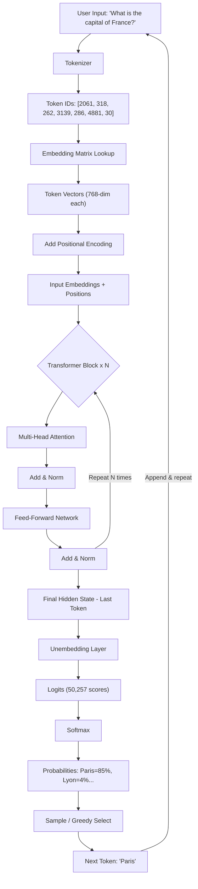

# LLM Mastery for Beginners: From Zero to Understanding Transformers

> *A friendly, step-by-step guide for complete beginners — no prior AI knowledge required.*

---

## 📚 Table of Contents

1. [What Is an LLM and Why It Matters](#1-what-is-an-llm-and-why-it-matters)
2. [Evolution of Language Models](#2-evolution-of-language-models)
3. [Tokenization — How Text Becomes Numbers](#3-tokenization--how-text-becomes-numbers)
4. [Embeddings & Vectorization](#4-embeddings--vectorization)
5. [The Transformer Architecture](#5-the-transformer-architecture)
6. [Encoder vs Decoder](#6-encoder-vs-decoder)
7. [Attention Mechanisms](#7-attention-mechanisms)
8. [Feed-Forward Networks (MLPs)](#8-feed-forward-networks-mlps)
9. [Unembedding — Turning Vectors Back Into Words](#9-unembedding--turning-vectors-back-into-words)
10. [Training LLMs](#10-training-llms)
11. [Hugging Face in Practice](#11-hugging-face-in-practice)
12. [Complete Under-the-Hood Flow](#12-complete-under-the-hood-flow)
13. [Bonus: Common Beginner Mistakes & Pro Tips](#13-bonus-common-beginner-mistakes--pro-tips)
14. [Quick Revision Cheat Sheet](#14-quick-revision-cheat-sheet)
15. [Next Steps](#15-next-steps)

---

# 1. What Is an LLM and Why It Matters

## 1.1 The Big Picture

Imagine you have a friend who has read *every book, website, article, and forum post on the internet*. You can ask this friend anything — write a poem, debug your code, explain quantum physics like you're five, or draft an email to your boss. That friend is a **Large Language Model (LLM)**.

An **LLM (Large Language Model)** is a type of artificial intelligence program that has been trained on massive amounts of text. It learns the patterns of human language so well that it can:

- Understand questions written in plain English
- Generate fluent, coherent, and contextually appropriate text
- Translate languages
- Summarize long documents
- Write and debug code
- Answer complex questions

> 💡 **Simple Definition:** An LLM is a computer program that predicts what words should come next in a sentence — but it does this so well that it can hold conversations, write essays, and solve problems.

## 1.2 Why Is It Called "Large"?

The word "Large" refers to two things:

| What's Large | What It Means |
|---|---|
| **Parameters** | The millions or billions of "settings" the model adjusts during learning |
| **Training Data** | The enormous amount of text (hundreds of gigabytes to terabytes) it was trained on |

For example:
- GPT-2 (2019): ~1.5 **billion** parameters
- GPT-3 (2020): ~175 **billion** parameters
- GPT-4 (2023): estimated ~1 **trillion** parameters

> 🧠 **Analogy:** Think of parameters like the dials and knobs on a mixing board in a recording studio. A beginner's mixer might have 20 knobs. An LLM has *billions* of knobs — all tuned to produce perfect language.

## 1.3 Real-World Uses of LLMs

LLMs are already changing how we work and live:

- **ChatGPT / Claude / Gemini** — Conversational AI assistants
- **GitHub Copilot** — AI that writes code alongside you
- **Grammarly** — AI that improves your writing
- **Google Translate** — Powered by language models
- **Customer Service Chatbots** — Handling millions of queries
- **Medical Research** — Summarizing scientific papers
- **Legal Tech** — Reviewing contracts automatically
- **Education** — Personalized tutoring

---

> ### 📌 Key Memorize Points
> - LLM = **Large Language Model** — AI trained on massive text data
> - "Large" refers to **parameters** (billions of settings) and **training data** (terabytes of text)
> - LLMs work by **predicting the next word** — but at a superhuman level
> - They power ChatGPT, Claude, Copilot, and many more tools

> ### 📏 Thumb Rules
> - More parameters ≠ always better, but generally = more capable
> - LLMs are *language* models — they understand and generate **text** (not images or video, by default)
> - An LLM doesn't "know" things the way humans do — it has learned **statistical patterns** from text

> ### 👶 12-Year-Old Example
> Think of autocomplete on your phone. When you type "I am going to the…" it suggests "store" or "park." An LLM is like autocomplete on *steroids* — instead of suggesting one word from your texts, it has read billions of pages and can write entire essays, stories, and code. It's not magic — it's just *very good pattern matching*.

---

# 2. Evolution of Language Models

## 2.1 Why Not Just Use Simple Rules?

Early AI researchers tried to teach computers language using **rules**: "If you see the word 'not', flip the meaning." This worked for toy examples but failed in the real world because human language is:

- Ambiguous ("I saw the man with the telescope" — who had the telescope?)
- Context-dependent ("He kicked the bucket" = he died, not a literal bucket)
- Constantly evolving (new slang, new words every year)

So researchers turned to **machine learning** — letting computers *learn* language from examples.

## 2.2 Era 1: Recurrent Neural Networks (RNNs) — The Sequential Readers

**RNNs** were the first real attempt at neural language models. Think of them like a person reading a book *one word at a time*, with a small notepad to remember what they've just read.

```
Word 1 → [RNN Cell] → Memory State
Word 2 → [RNN Cell + Memory State] → New Memory State
Word 3 → [RNN Cell + New Memory State] → ...
```

**The Problem — Forgetting Things!**

Imagine you're reading a 500-page novel, and the main character's name was mentioned only on page 1. By page 499, you've forgotten it. RNNs had the same problem — they forgot information from far back in the sequence. This is called the **vanishing gradient problem**.

> 🧠 **Analogy:** An RNN is like a person with short-term memory. They can remember the last few things you said, but ask them what you said an hour ago and they're lost.

## 2.3 Era 2: LSTMs — The Notepad with Sticky Notes

**LSTM (Long Short-Term Memory)** networks were invented to fix RNN's forgetting problem. They added a special **memory cell** — like giving our reader a highlighter and a bookmark system.

LSTMs have three special "gates":

| Gate | Job | Analogy |
|---|---|---|
| **Forget Gate** | Decide what old info to erase | Throwing away irrelevant notes |
| **Input Gate** | Decide what new info to save | Writing important things on a sticky note |
| **Output Gate** | Decide what info to use right now | Reading from your notes to answer a question |

**LSTMs were better**, but still had problems:
- They're **slow** — you can only process one word at a time (sequential)
- They still struggled with **very long texts**
- They're hard to **parallelize** (run on multiple processors at once)

## 2.4 Era 3: Transformers — The Game Changer (2017)

In 2017, a landmark paper called **"Attention Is All You Need"** (by researchers at Google) introduced the **Transformer** architecture. It threw away the sequential processing of RNNs entirely.

The revolutionary idea: **look at ALL words at the same time and figure out which ones are important to each other.**

```
RNN:    Word1 → Word2 → Word3 → Word4 → Word5   (slow, sequential)
        
Transformer: [Word1, Word2, Word3, Word4, Word5]  (fast, parallel)
              ↕     ↕     ↕     ↕     ↕
              All words attend to all other words simultaneously
```

**Why Transformers Won:**

| Feature | RNN/LSTM | Transformer |
|---|---|---|
| Processing | Sequential (slow) | Parallel (fast) |
| Long-range memory | Weak | Excellent |
| Scalability | Limited | Scales to billions of params |
| GPU efficiency | Poor | Excellent |

> 🧠 **Analogy:** An RNN reads a sentence like you read subtitles — one at a time, left to right. A Transformer reads a sentence like you glance at a whole page — instantly seeing how all the words relate to each other.

---

> ### 📌 Key Memorize Points
> - **RNNs** process words one at a time and forget distant context
> - **LSTMs** added memory gates to help remember — better, but still slow
> - **Transformers** process ALL words simultaneously and track relationships between any two words, regardless of distance
> - The paper "**Attention Is All You Need**" (2017) started the Transformer revolution

> ### 📏 Thumb Rules
> - Sequential processing = bottleneck. Parallel processing = speed
> - The further apart two words are, the harder it is for RNNs — but Transformers handle this equally well regardless of distance
> - Every modern LLM (GPT, BERT, Claude, Gemini) is based on the Transformer

> ### 👶 12-Year-Old Example
> Imagine you need to figure out which kid in your class brought the ball to recess. An RNN asks each kid one at a time, in order. A Transformer sends a question to *all* kids at once and gets everyone's answer simultaneously. Which is faster? The Transformer, obviously!

---

# 3. Tokenization — How Text Becomes Numbers

## 3.1 Why Computers Need Numbers

Computers don't understand letters or words — they only understand **numbers**. So before any text can be fed into an LLM, we need to convert it to numbers. This process is called **tokenization**.

> 💡 **Definition:** **Tokenization** is the process of splitting text into smaller pieces called **tokens**, and then converting each token into a unique number (ID).

## 3.2 What Is a Token?

A **token** is NOT always a full word. It can be:

- A full word: `"cat"` → token
- Part of a word: `"unbelievable"` → `["un", "believ", "able"]` → 3 tokens
- A punctuation mark: `"."` → token
- A space: `" "` → token
- A special symbol: `"<|endoftext|>"` → token

> 🧠 **Analogy:** Think of a token like a *Scrabble tile*. You don't play whole words — you play tiles. Some tiles are whole words ("cat"), some are parts of words ("ing", "un"). The LLM thinks in tiles, not full words.

## 3.3 How Does Tokenization Work? (BPE — Byte Pair Encoding)

Most modern LLMs use an algorithm called **Byte Pair Encoding (BPE)**. Here's the simple idea:

1. Start with individual characters: `["h", "e", "l", "l", "o"]`
2. Find the most common pair and merge it: `"he"` appears a lot → merge to `["he", "l", "l", "o"]`
3. Repeat until you have a vocabulary of ~50,000 tokens

This way, common words become single tokens (`"the"`, `"is"`, `"cat"`), while rare or new words are broken into smaller pieces.

**Example:**

```
Input text:   "The cat sat on the mat."

Tokens:       ["The", " cat", " sat", " on", " the", " mat", "."]

Token IDs:    [464,   4097,  3332,  319,  262,   2705,  13]
```

Notice `" cat"` (with a space before it) is treated differently from `"cat"` at the start — spaces are often part of the token!

## 3.4 Using AutoTokenizer (Hugging Face)

In practice, you'll use the `AutoTokenizer` from the Hugging Face library. Here's what it does:

```python
from transformers import AutoTokenizer

# Load a tokenizer for GPT-2
tokenizer = AutoTokenizer.from_pretrained("gpt2")

text = "The cat sat on the mat."

# Tokenize
tokens = tokenizer.tokenize(text)
print(tokens)
# Output: ['The', 'Ġcat', 'Ġsat', 'Ġon', 'Ġthe', 'Ġmat', '.']
# (Ġ = space before the word)

# Convert to IDs
ids = tokenizer.encode(text)
print(ids)
# Output: [464, 3797, 3332, 319, 262, 2603, 13]

# Decode back to text
decoded = tokenizer.decode(ids)
print(decoded)
# Output: "The cat sat on the mat."
```

## 3.5 Special Tokens

Most LLMs use **special tokens** for structure:

| Token | Meaning |
|---|---|
| `[CLS]` | Start of sequence (BERT-style) |
| `[SEP]` | Separator between sentences |
| `[PAD]` | Padding to make all sequences the same length |
| `[MASK]` | Hidden word for BERT's training |
| `<\|endoftext\|>` | End of document (GPT-style) |
| `<s>` / `</s>` | Start and end of sequence |

## 3.6 Context Window

Every LLM has a **context window** — the maximum number of tokens it can process at once.

- GPT-2: 1,024 tokens (~750 words)
- GPT-3: 4,096 tokens (~3,000 words)
- GPT-4: 128,000 tokens (~96,000 words)
- Claude 3: 200,000 tokens (~150,000 words)

> ⚠️ If your input is longer than the context window, the model simply can't see the earlier parts. It's like the model has a reading window of fixed size — anything outside it is invisible.

---

> ### 📌 Key Memorize Points
> - **Tokenization** converts text to numbers so the model can process it
> - Tokens are **chunks of text** — sometimes words, sometimes parts of words
> - Most LLMs use **BPE (Byte Pair Encoding)** to build their vocabulary
> - `AutoTokenizer` from Hugging Face handles tokenization automatically
> - Every model has a **context window** — the max number of tokens it can "see" at once

> ### 📏 Thumb Rules
> - ~1 token ≈ 0.75 English words (rough rule of thumb)
> - Rare words take more tokens than common words
> - The model never sees raw text — always token IDs (numbers)
> - Longer context window = more expensive to run (costs grow quadratically)

> ### 👶 12-Year-Old Example
> Imagine you want to teach a robot to understand English, but the robot only understands numbers. You create a dictionary: "cat" = 42, "dog" = 99, "the" = 1, etc. That's tokenization! The robot reads "the cat" as `[1, 42]`. The tokenizer is just that dictionary — but smarter, because it handles words it's never seen by breaking them into pieces.

---

# 4. Embeddings & Vectorization

## 4.1 The Problem With Raw Token IDs

After tokenization, we have numbers like `[464, 3797, 3332]`. But these numbers are just labels — they don't carry any meaning. The number 464 doesn't tell the model anything about the word "The." The model needs a richer way to represent meaning.

Enter **embeddings**.

## 4.2 What Is an Embedding?

An **embedding** converts a token ID into a **vector** — a list of numbers that captures the meaning of that token.

> 💡 **Definition:** An **embedding** is a dense vector (list of numbers) that represents a word's meaning in a multi-dimensional space. Words with similar meanings end up close together in that space.

**Example:**
```
"cat"  → [0.2, -0.5, 0.8, 0.1, ..., 0.3]   (768 numbers)
"dog"  → [0.2, -0.4, 0.7, 0.2, ..., 0.4]   (768 numbers — similar to "cat"!)
"car"  → [-0.8, 0.9, -0.1, 0.6, ..., -0.2] (768 numbers — very different)
```

Notice that "cat" and "dog" have similar vectors — they're both animals. "Car" looks completely different.

## 4.3 The Magic of Vector Space

> 🧠 **Analogy:** Imagine placing every word on a giant map. Words that are related are placed close together. "Cat," "dog," and "hamster" are all in the "pet" neighborhood. "Paris," "London," and "Tokyo" are in the "capital city" neighborhood. This map is the **embedding space**.

The truly magical property of embeddings (discovered in **Word2Vec**, 2013):

```
King - Man + Woman ≈ Queen
Paris - France + Germany ≈ Berlin
```

This tells us the embeddings have actually learned *semantic relationships* — not just memorized words!

## 4.4 Input Embeddings in Transformers

In a Transformer, every token ID is looked up in an **embedding matrix** — a giant table where each row is a token's vector.

```
Embedding Matrix (Vocabulary Size × Embedding Dimension):

Token ID 464 ("The") → Row 464 → [0.1, 0.3, -0.2, ..., 0.8]   ← 768 numbers
Token ID 3797 ("cat") → Row 3797 → [0.4, -0.1, 0.9, ..., 0.2]  ← 768 numbers
...
```

For GPT-2:
- Vocabulary size: 50,257 tokens
- Embedding dimension: 768
- Embedding matrix size: 50,257 × 768 = ~38.6 million numbers

## 4.5 Positional Encoding — Teaching Order to the Model

Here's a big problem: when we look up all token embeddings, we lose the **order** of words!

`"The cat sat"` and `"Sat cat the"` would produce the same set of embeddings.

We need to tell the model *where* each word is in the sequence. The solution is **positional encoding**.

**How it works:**

Each position in the sequence gets its own special vector added to the word embedding:

```
Final Input = Word Embedding + Positional Encoding

Position 0 ("The"):  [0.1, 0.3, -0.2, ..., 0.8]   (word)
                   + [0.0, 1.0,  0.0, ..., 0.0]   (position 0 signal)
                   = [0.1, 1.3, -0.2, ..., 0.8]   (final input vector)
```

The original Transformer paper used **sinusoidal functions** (sine and cosine waves) of different frequencies to create these position signals. Modern LLMs often use **learned positional encodings** — the model figures out the best position signals during training.

> 🧠 **Analogy:** Imagine you're numbering seats in a classroom. Word embeddings tell you *who* is sitting. Positional encodings tell you *which seat number* they're in. You need both to know who is where.

---

> ### 📌 Key Memorize Points
> - **Embeddings** convert token IDs into rich vectors that capture meaning
> - Similar words have **similar vectors** (close in embedding space)
> - The **embedding matrix** maps each token to a unique vector
> - **Positional encoding** adds information about word order to the embeddings
> - Final input to the Transformer = **Word Embedding + Positional Encoding**

> ### 📏 Thumb Rules
> - Typical embedding dimensions: 768 (small), 1024 (medium), 4096+ (large models)
> - Embeddings are **learned during training** — they improve over time
> - Word2Vec showed that embeddings capture analogies: King - Man + Woman = Queen
> - Without positional encoding, the model would be **order-blind**

> ### 👶 12-Year-Old Example
> Imagine each word in the English language gets a GPS coordinate. "Cat" might be at (3, 7, -2) and "dog" at (3.1, 6.9, -2.1) — very close! "Mountain" would be at (-50, 20, 80) — far away. Now, instead of just 3 coordinates, imagine 768 coordinates. That's an embedding! The model uses these coordinates to understand meaning. And positional encoding is like adding a timestamp to each coordinate so the model knows if "cat" came first or second in the sentence.

---

# 5. The Transformer Architecture

## 5.1 The Big Picture

A Transformer is like a **factory assembly line** for understanding text. Raw text goes in one end, processed meaning comes out the other. Let's look at the complete picture before diving into each piece.

## 5.2 High-Level Flow Diagram

```
INPUT TEXT
    |
    ▼
┌─────────────────────────┐
│      TOKENIZER          │  "The cat sat" → [464, 3797, 3332]
└─────────────────────────┘
    |
    ▼
┌─────────────────────────┐
│   INPUT EMBEDDINGS      │  Token IDs → Vectors [768 numbers each]
│ + POSITIONAL ENCODING   │  + Position information added
└─────────────────────────┘
    |
    ▼
┌═══════════════════════════════════════════════════╗
║           TRANSFORMER BLOCKS (repeated N times)   ║
║                                                   ║
║   ┌─────────────────────────────────────────┐    ║
║   │         MULTI-HEAD ATTENTION            │    ║
║   │  (words look at each other & decide     │    ║
║   │   what's relevant)                      │    ║
║   └─────────────────────────────────────────┘    ║
║               |                                   ║
║           Add & Norm  (Residual connection)       ║
║               |                                   ║
║   ┌─────────────────────────────────────────┐    ║
║   │         FEED-FORWARD NETWORK            │    ║
║   │  (process each word's representation   │    ║
║   │   through a mini neural network)        │    ║
║   └─────────────────────────────────────────┘    ║
║               |                                   ║
║           Add & Norm  (Residual connection)       ║
║                                                   ║
╚═══════════════════════════════════════════════════╝
    |
    ▼
┌─────────────────────────┐
│    UNEMBEDDING LAYER    │  Final vectors → Vocabulary scores
│       + SOFTMAX         │  Scores → Probabilities
└─────────────────────────┘
    |
    ▼
OUTPUT TOKEN
(next predicted word)
```

## 5.3 The Stack: How Many Layers?

A single Transformer "block" (attention + feed-forward) is repeated many times. The number of blocks is called the **depth** of the model.

| Model | # of Layers | Embedding Dim | Parameters |
|---|---|---|---|
| GPT-2 Small | 12 layers | 768 | 117M |
| GPT-2 XL | 48 layers | 1600 | 1.5B |
| GPT-3 | 96 layers | 12288 | 175B |
| BERT Base | 12 layers | 768 | 110M |

> 🧠 **Analogy:** Think of each Transformer block as one "round of thinking." After each round, the model understands the text a little better. 12 rounds = 12 layers. 96 rounds = 96 layers. More rounds = deeper understanding, but also more computation.

## 5.4 Residual Connections & Layer Normalization

You'll notice "Add & Norm" in the diagram. These are two important tricks:

**Residual Connections (Add):**
Instead of replacing the input, we *add* the output to the original input:
```
Output = LayerOutput + Input (original)
```
This is like a "shortcut" — information can bypass each layer if needed. It prevents gradients from disappearing during training.

**Layer Normalization (Norm):**
After each sub-layer, we normalize the values to have a mean of 0 and standard deviation of 1. This keeps numbers in a healthy range and stabilizes training.

---

> ### 📌 Key Memorize Points
> - A Transformer = **Embedding → Stack of Blocks → Unembedding**
> - Each block = **Multi-Head Attention + Feed-Forward Network**
> - Blocks are **repeated N times** (12, 24, 48, 96...)
> - **Residual connections** add original input back to each sub-layer's output
> - **Layer normalization** keeps values stable throughout the network

> ### 📏 Thumb Rules
> - More layers = deeper understanding but slower and more expensive
> - Every modern LLM (GPT, BERT, Claude, Llama) follows this same core architecture
> - The "magic" of LLMs is mostly in the **attention mechanism** inside each block

> ### 👶 12-Year-Old Example
> Imagine an essay goes through 12 different teachers. Each teacher reads it and adds helpful notes in the margins (that's the attention layer — understanding relationships). Then each teacher's assistant rewrites the essay more clearly (that's the feed-forward layer). After 12 teachers and 12 assistants, the essay has been understood deeply. The final teacher then outputs the next word of the response.

---

# 6. Encoder vs Decoder

## 6.1 Two Flavors of Transformer

When the Transformer was invented, it had two parts:
- An **Encoder**: reads and understands the input
- A **Decoder**: generates the output

But over time, researchers realized you could use *just* the encoder or *just* the decoder (or both!) depending on your task. This gave us two major families of models.

## 6.2 Encoder-Only Models (e.g., BERT)

**BERT (Bidirectional Encoder Representations from Transformers)** uses only the encoder.

**Key characteristic:** The encoder can look at words in **both directions** — left and right simultaneously. It sees the entire sentence at once.

```
Input:  "The cat sat on the [MASK]."
        ←←←←←←←←←←→→→→→→→
        BERT looks both ways

Output: Probability that [MASK] = "mat", "floor", "bench", etc.
```

**Best for tasks where you need to understand text:**
- Sentiment analysis ("Is this review positive or negative?")
- Named Entity Recognition ("Is 'Paris' a city or a person's name?")
- Question answering (understanding both the question and the passage)
- Text classification

## 6.3 Decoder-Only Models (e.g., GPT)

**GPT (Generative Pre-trained Transformer)** uses only the decoder.

**Key characteristic:** The decoder can only look **left** (backward) — it only sees the words that came before, not after. This is called **causal** or **autoregressive** attention.

```
Input:  "The cat sat on the"
        →→→→→→→→→
        GPT only looks left (past)

Output: "mat" (predicted next word)
```

**Best for tasks where you need to generate text:**
- Text generation and creative writing
- Chatbots and conversational AI
- Code completion (GitHub Copilot)
- Summarization
- Translation (with prompting)

## 6.4 Encoder-Decoder Models (e.g., T5, BART)

Some models use **both** encoder and decoder:
- The encoder reads and understands the input
- The decoder generates the output based on the encoder's understanding

**Best for:**
- Machine translation (English → French)
- Abstractive summarization
- Question answering with generation

## 6.5 The Quick Comparison Table

| Feature | Encoder (BERT) | Decoder (GPT) | Encoder-Decoder (T5) |
|---|---|---|---|
| Attention direction | Both ways | Left only | Both / Left |
| Primary use | Understanding | Generating | Sequence-to-Sequence |
| Training method | Masked LM | Next token prediction | Span/sequence prediction |
| Examples | BERT, RoBERTa | GPT-2/3/4, Llama, Claude | T5, BART, mT5 |

---

> ### 📌 Key Memorize Points
> - **Encoder-only** (BERT): sees all words at once → great for *understanding*
> - **Decoder-only** (GPT): sees only past words → great for *generating*
> - **Encoder-Decoder** (T5): reads input, then generates output → great for *translation/summarization*
> - The key difference is the **attention mask**: bidirectional vs causal

> ### 📏 Thumb Rules
> - If your task is "classify this text" → use **Encoder** (BERT-style)
> - If your task is "generate text" → use **Decoder** (GPT-style)
> - If your task is "transform text A into text B" → use **Encoder-Decoder** (T5-style)
> - Most modern chatbots (GPT-4, Claude, Llama) are **decoder-only**

> ### 👶 12-Year-Old Example
> Encoder is like a *reader* — it reads the whole book and understands it deeply. Decoder is like an *author* — it writes the next sentence of the story, one word at a time, based only on what it's written so far. Encoder-Decoder is like a *translator* — it reads an entire Spanish paragraph (encoder), then writes the English version word by word (decoder).

---

# 7. Attention Mechanisms

## 7.1 The Biggest Innovation in Modern AI

The attention mechanism is *the* core innovation of the Transformer. It solves the fundamental problem that plagued earlier models: **how do you figure out which words are important to understand the current word?**

> 💡 **Core Idea:** For every word in the sentence, attention calculates a "relevance score" between that word and every other word. High score = "pay attention to this word when processing that word."

## 7.2 The Classroom Analogy

> 🧠 **Analogy:** Imagine a classroom of 10 students taking a quiz. The question is "What is the name of the country's leader?" Each student (word) needs to gather information from their classmates (other words). 
>
> - The student working on "leader" naturally turns to look at the student with info about "country" and "name"
> - They barely pay attention to the student who knows about "the" or "is"
> - This "turning to look at relevant classmates" is exactly what **attention** does!

## 7.3 How Self-Attention Works (Step by Step)

**Self-attention** means each word attends to *every other word in the same sequence* (including itself). Here's how it works:

**Step 1: Create Three Vectors for Each Token**

For each token, we create three vectors using learned weight matrices:
- **Q (Query):** "What am I looking for?"
- **K (Key):** "What information do I have?"
- **V (Value):** "What information should I share?"

```
Token: "cat"
  Query  (Q): [0.2, -0.1, 0.5]   ← "I'm looking for animal-related info"
  Key    (K): [0.3,  0.4, -0.2]  ← "I have 'feline/pet' information"
  Value  (V): [0.8, -0.3,  0.9]  ← "Here's what I know about cats"
```

> 🧠 **Analogy:** Q = your search query on Google, K = the webpage titles, V = the actual webpage content. Attention matches your query to the best keys and retrieves the values.

**Step 2: Calculate Attention Scores**

For each pair of tokens (i, j), multiply Query_i by Key_j:

```
Score("cat" attends to "sat") = Q_cat · K_sat = dot product
Score("cat" attends to "the") = Q_cat · K_the = dot product
...
```

Higher score = more attention. Divide by √(dimension) to stabilize values.

**Step 3: Softmax to Get Probabilities**

Pass scores through **Softmax** to convert them to probabilities that sum to 1:

```
Before softmax:  [3.2, 0.1, 2.8, 0.5, 1.9]
After softmax:   [0.42, 0.02, 0.36, 0.03, 0.17]
                  (all add up to 1.0)
```

**Step 4: Weighted Sum of Values**

Multiply each token's Value by its attention probability and sum them up:

```
New representation of "cat" = 
    0.42 × V("The") + 0.02 × V("cat") + 0.36 × V("sat") + ...
```

This gives each token a rich new representation incorporating information from all other tokens it should attend to.

**The Full Formula:**

```
Attention(Q, K, V) = softmax(Q·Kᵀ / √d_k) · V
```

Where `d_k` is the dimension of the key vectors.

## 7.4 Multi-Head Attention

Single attention is good, but what if different aspects of relationships need to be tracked simultaneously?

> 🧠 **Analogy:** When you read "The animal didn't cross the street because it was too tired," you need to figure out:
> - What does "it" refer to? (coreference — one type of relationship)
> - What kind of tiredness? (modifier — another type)
> - What's the causal relationship? (another type)

**Multi-head attention** runs the attention mechanism multiple times in **parallel**, each with different learned weight matrices (different "heads"). Each head can specialize in a different type of relationship.

```
Input
  |
  ├──→ [Attention Head 1] → Output1  (learns syntax)
  ├──→ [Attention Head 2] → Output2  (learns coreference)
  ├──→ [Attention Head 3] → Output3  (learns semantics)
  └──→ [Attention Head N] → OutputN  (learns ?)
              |
              ▼
       Concatenate all outputs
              |
              ▼
       Linear projection
              |
              ▼
     Final Multi-Head Attention Output
```

Typical number of heads: 12 (GPT-2), 32 (GPT-3), 128 (GPT-4)

## 7.5 Attention Masking (for Decoders)

In **decoder** models (like GPT), we prevent words from attending to future words. This is called the **causal mask** or **look-ahead mask**.

```
Attention mask for "The cat sat" (decoder):

         The   cat   sat
The  [ [1,     0,    0  ],    ← "The" can only see itself
cat  →  [1,     1,    0  ],   ← "cat" sees "The" and "cat"
sat  →  [1,     1,    1  ] ]  ← "sat" sees all three
```

1 = can attend, 0 = blocked (set to -∞ before softmax)

---

> ### 📌 Key Memorize Points
> - **Self-attention** lets every word look at every other word and decide what's relevant
> - Three vectors: **Q (Query)**, **K (Key)**, **V (Value)** — created per token via learned matrices
> - Attention score = **Q · K** (dot product) → normalized → softmax → weighted sum of V
> - **Multi-head attention** runs multiple attention operations in parallel, each learning different relationships
> - **Causal masking** in decoders prevents future words from being seen

> ### 📏 Thumb Rules
> - Attention = "Find the most relevant words and borrow their information"
> - More heads = model can track more types of relationships simultaneously
> - Attention is O(n²) in sequence length — the main bottleneck for long contexts
> - The `√d_k` scaling factor prevents dot products from getting too large (causing vanishing gradients in softmax)

> ### 👶 12-Year-Old Example
> You're writing a book report on "Harry Potter." For every sentence you write, you look back at the book to find the relevant parts. "Hermione was smart" — you look at all the pages about Hermione. "The castle was dark" — you look at castle descriptions. You naturally pay more attention to relevant pages and less to irrelevant ones. That's self-attention! Multi-head attention means you have multiple highlighters — one for character descriptions, one for plot events, one for settings — all working at the same time.

---

# 8. Feed-Forward Networks (MLPs)

## 8.1 What Comes After Attention?

After the attention mechanism gives each token a rich new representation, the data passes through a **Feed-Forward Network (FFN)**, also called an **MLP (Multi-Layer Perceptron)**.

Think of attention as gathering information from other words, and the FFN as *thinking about* that information.

## 8.2 Structure of the FFN

Each Transformer block has one FFN, applied **independently to each token position** (they don't share information here — that's attention's job).

The FFN has a simple structure:

```
Input (d_model dimensions)
    |
    ▼
Linear Layer (d_model → d_ff)      ← "expand"
    |
    ▼
Activation Function (GELU or ReLU) ← "decide what's important"
    |
    ▼
Linear Layer (d_ff → d_model)      ← "compress back"
    |
    ▼
Output (d_model dimensions)
```

> 💡 **Key Number:** The inner dimension `d_ff` is typically **4× larger** than `d_model`.
> - GPT-2: d_model = 768, d_ff = 3072 (4×)
> - GPT-3: d_model = 12288, d_ff = 49152 (4×)

## 8.3 What Does the FFN Actually Do?

Research suggests the FFN layers in Transformers act as a kind of **key-value memory**:

> 🧠 **Analogy:** If attention is like asking your friends "What do you know about Paris?", the FFN is like consulting your own internal encyclopedia — looking up "Paris" and retrieving "capital of France, Eiffel Tower, population ~2 million..."

The FFN is where the model stores and retrieves **factual knowledge**. When people say LLMs have "knowledge," a lot of that lives in the FFN weights.

## 8.4 Activation Functions

The non-linear activation function between the two linear layers is crucial — without it, the whole thing would just be one linear transformation (boring and limited).

**GELU (Gaussian Error Linear Unit):** The activation used in most modern LLMs (GPT, BERT):

```
GELU(x) ≈ x × Φ(x)
```

It's a smooth, curved function that keeps useful signals and dampens others. Think of it as a smart gate — some information passes through fully, some partially, some not at all.

---

> ### 📌 Key Memorize Points
> - The **FFN processes each token independently** after attention
> - It expands to 4× the model dimension, then compresses back
> - FFN layers are where **factual knowledge** is stored in the model
> - The **activation function** (GELU/ReLU) adds non-linearity, enabling complex patterns

> ### 📏 Thumb Rules
> - Attention = "gather info from other words" → FFN = "process your own info"
> - No FFN = model can only blend information, not process it deeply
> - The FFN contains the **most parameters** in a typical Transformer (more than attention)

> ### 👶 12-Year-Old Example
> After the attention mechanism helps you figure out which classmates' notes are relevant, the FFN is like sitting down alone and *processing* those notes. You read them, organize them in your head, and transform them into something useful. The expansion (4×) is like spreading all your notes on a desk to see everything at once, and the compression is like writing a clean summary.

---

# 9. Unembedding — Turning Vectors Back Into Words

## 9.1 The Final Step

After the input has passed through all Transformer blocks, we have a final vector for each token position. For text generation, we care about the *last* token's vector — it represents the model's best understanding of "what should come next?"

Now we need to convert this vector back into a word. This is the **unembedding** step.

## 9.2 The Unembedding Matrix

The unembedding matrix is essentially the reverse of the embedding matrix. It projects the final vector back into the vocabulary space:

```
Final hidden vector (d_model dimensions)
              |
              ▼
    Unembedding Matrix (d_model × vocab_size)
              |
              ▼
    Logit scores (one per vocabulary token)
              |
              ▼
    Softmax → Probabilities (one per vocabulary token)
              |
              ▼
    Sample or pick highest → Next Token!
```

> 💡 **Logits:** Raw scores before softmax. High logit = model thinks this token is likely next.

**Example:**
```
Top logit scores after processing "The cat sat on the":
  "mat"    → 8.2   (probability 42%)
  "floor"  → 7.1   (probability 24%)
  "ground" → 6.8   (probability 18%)
  "roof"   → 3.2   (probability 4%)
  ...all other 50,000 tokens have lower scores
```

## 9.3 Sampling Strategies

Once we have probabilities, how do we pick the next word? There are several strategies:

| Strategy | How It Works | When to Use |
|---|---|---|
| **Greedy** | Always pick the highest probability token | Fast but repetitive |
| **Temperature** | Divide logits by T before softmax (T>1 = more random, T<1 = more focused) | Controlling creativity |
| **Top-k** | Sample from only the top k tokens | Balances quality & diversity |
| **Top-p (nucleus)** | Sample from fewest tokens whose probability sums to p | State of the art |
| **Beam search** | Track top B sequences simultaneously | Translation/summarization |

> 🧠 **Analogy:** After cooking, you have a menu of possible next courses (desserts). Greedy = always pick the most popular dessert. Top-k = randomly choose from the 10 most popular. Temperature = if T is high, even unpopular desserts have a chance; if T is low, you almost always pick #1.

## 9.4 Tied Weights

An interesting implementation detail: in many LLMs, the **embedding matrix and unembedding matrix share the same weights** (called "weight tying"). This halves the number of parameters and often improves performance.

---

> ### 📌 Key Memorize Points
> - The **unembedding layer** converts the final vector into a score for each vocabulary token
> - **Logits** are raw scores; **softmax** converts them to probabilities
> - **Greedy decoding** picks the most likely token; **sampling** introduces randomness
> - **Temperature** controls creativity: higher T = more random, lower T = more focused
> - **Top-p (nucleus) sampling** is the most popular strategy for quality text generation

> ### 📏 Thumb Rules
> - Temperature 0 ≈ deterministic (always same output); Temperature 1 = default; Temperature 2+ = very random
> - Top-p = 0.9 is a common good default for creative tasks
> - The model generates text **one token at a time** — it's always predicting just the next token

> ### 👶 12-Year-Old Example
> Imagine the model is playing a word prediction game. After all its "thinking," it looks at a list of every word it knows (50,000 words!) and gives each one a score. "Mat" gets 100 points, "floor" gets 85 points, "moon" gets 2 points. Then we convert scores to percentages. Do we always pick the top scorer? Not necessarily — sometimes we randomly pick from the top 10 for variety. That's why ChatGPT gives slightly different answers every time you ask the same question!

---

# 10. Training LLMs

## 10.1 The Core Training Objective: Predict the Next Word

Training an LLM is deceptively simple in concept: **show the model a lot of text, and train it to predict the next word.**

This is called **autoregressive language modeling** or **causal language modeling**.

**Example:**

```
Training sentence: "The quick brown fox jumps over the lazy dog"

Training examples generated automatically:

Input: "The"                              → Predict: "quick"
Input: "The quick"                        → Predict: "brown"
Input: "The quick brown"                  → Predict: "fox"
Input: "The quick brown fox"              → Predict: "jumps"
Input: "The quick brown fox jumps"        → Predict: "over"
...
```

Every piece of text on the internet becomes *self-supervised training data* — you don't need humans to label anything. The labels are just the next words!

## 10.2 The Training Loop

```
1. SAMPLE a batch of text from the training data
2. TOKENIZE the text into token IDs
3. FORWARD PASS: feed tokens into model → get probability for each next token
4. CALCULATE LOSS: compare predicted probabilities to actual next tokens
   (using Cross-Entropy Loss — penalize wrong predictions)
5. BACKWARD PASS: calculate gradients (how to adjust each parameter)
6. UPDATE WEIGHTS: adjust all parameters slightly in the right direction
7. REPEAT billions of times
```

> 🧠 **Analogy:** It's like teaching a student with flashcards. You show them "The quick brown ___" and they guess. If they say "fox," great! If they say "elephant," you correct them. Over millions of flashcard sessions, they get very good at predicting the right word.

## 10.3 The Loss Function: Cross-Entropy

The model's "wrongness score" is measured using **cross-entropy loss**:

```
Loss = -log(probability assigned to the correct next token)
```

- If model predicted "fox" with 90% probability and "fox" was correct → Loss ≈ 0.1 (good!)
- If model predicted "fox" with 1% probability and "fox" was correct → Loss ≈ 4.6 (bad!)

The goal of training is to **minimize this loss** across all training examples.

## 10.4 Gradient Descent & Learning Rates

To minimize loss, we use **gradient descent**:

1. Calculate the gradient (direction of steepest increase in loss)
2. Move *opposite* to the gradient (downhill = lower loss)
3. The **learning rate** controls *how big* each step is

**Why small learning rates?**

```
Too large: ████████████  → overshoot, oscillate, diverge
Too small: ·              → never reach minimum (too slow)
Just right: ──────────→  → smooth convergence
```

Modern LLMs use:
- Very small learning rates (e.g., 3×10⁻⁴ for GPT-3)
- **Learning rate schedules** — start small, gradually increase (warmup), then gradually decrease
- **AdamW optimizer** — a smarter version of gradient descent that adapts to each parameter

## 10.5 AutoModelForCausalLM

In Hugging Face, the class used for decoder-style (next-token-prediction) models is:

```python
from transformers import AutoModelForCausalLM

model = AutoModelForCausalLM.from_pretrained("gpt2")
```

The "CausalLM" means:
- **Causal**: the model can only look at past tokens (not future)
- **LM (Language Model)**: trained to predict the next token

## 10.6 Training vs. Inference

| Phase | What Happens | Computational Cost |
|---|---|---|
| **Training** | Forward pass + loss calculation + backward pass + weight update | Very expensive (weeks on thousands of GPUs) |
| **Inference** | Forward pass only | Much cheaper (seconds on one GPU) |

> 💡 **Key Point:** GPT-3 training cost ~$4.6 million in compute. But once trained, you can run inference (use it) for fractions of a cent per query.

## 10.7 RLHF — Making LLMs Helpful

Raw pre-trained LLMs are good at predicting text, but they're not necessarily *helpful* assistants. Modern assistants (ChatGPT, Claude) go through additional training called **RLHF (Reinforcement Learning from Human Feedback)**:

1. **Pre-training:** Train on massive text (predict next word)
2. **Supervised Fine-tuning (SFT):** Train on high-quality question-answer pairs written by humans
3. **Reward Model Training:** Train a model to judge which responses are better
4. **RLHF/PPO:** Fine-tune the LLM to produce responses the reward model rates highly

---

> ### 📌 Key Memorize Points
> - Training objective = **predict the next token** (autoregressive / causal language modeling)
> - Labels are free — every piece of text is **self-supervised training data**
> - Loss = **cross-entropy** (how wrong was the prediction?)
> - We minimize loss using **gradient descent** + small learning rates
> - **AdamW optimizer** is the standard for LLM training
> - Training = expensive (weeks, millions of dollars); Inference = cheap (seconds)
> - RLHF makes raw LLMs into helpful, safe assistants

> ### 📏 Thumb Rules
> - Smaller learning rate = more stable but slower training
> - More data + more compute ≈ better model (Scaling Laws)
> - Never use a learning rate > 1e-3 for LLM fine-tuning; 1e-5 to 3e-4 is typical
> - Always use a **learning rate warmup** — start from 0, ramp up, then decay

> ### 👶 12-Year-Old Example
> Imagine training your dog with treats. You show him "sit" and if he sits, he gets a treat (reward, low loss). If he barks, no treat (high loss). After thousands of repetitions, he always sits on command. LLM training is the same — but instead of "sit," the command is "predict the next word," and there are *billions* of repetitions with an automatic grading system (cross-entropy loss). RLHF is like hiring a trainer who also teaches the dog to be polite and helpful, not just correct.

---

# 11. Hugging Face in Practice

## 11.1 What Is Hugging Face?

**Hugging Face** is a company and open-source platform that has become the *GitHub of AI*. They provide:

- A hub with **hundreds of thousands of pre-trained models** (free to download)
- The `transformers` Python library — the standard tool for working with LLMs
- Datasets, tokenizers, and training tools
- A community of AI researchers and practitioners

> 🧠 **Analogy:** If AI models were LEGO sets, Hugging Face is the LEGO store — thousands of pre-built sets (models) you can download and use, or mix and match to build your own thing.

## 11.2 Installation

```bash
pip install transformers
pip install torch          # or tensorflow
pip install accelerate     # for faster inference
```

## 11.3 Method 1: The pipeline() API (Super Simple)

The `pipeline()` function is the **simplest way** to use any LLM. One line to set up, one line to run:

```python
from transformers import pipeline

# Text generation
generator = pipeline("text-generation", model="gpt2")
result = generator("Once upon a time,", max_new_tokens=50)
print(result[0]['generated_text'])
# "Once upon a time, in a land far away, there lived a..."

# Sentiment analysis
classifier = pipeline("sentiment-analysis")
result = classifier("I love this movie!")
print(result)
# [{'label': 'POSITIVE', 'score': 0.9998}]

# Text summarization
summarizer = pipeline("summarization", model="facebook/bart-large-cnn")
result = summarizer("Long article text here...", max_length=130, min_length=30)
print(result[0]['summary_text'])

# Question answering
qa = pipeline("question-answering", model="deepset/roberta-base-squad2")
result = qa(question="What is the capital of France?", context="France is a country. Paris is its capital city.")
print(result['answer'])
# "Paris"
```

**Available pipeline tasks:**

| Task | Pipeline Name |
|---|---|
| Text generation | `"text-generation"` |
| Fill in the blank | `"fill-mask"` |
| Sentiment analysis | `"sentiment-analysis"` |
| Question answering | `"question-answering"` |
| Summarization | `"summarization"` |
| Translation | `"translation_en_to_fr"` |
| Named entity recognition | `"ner"` |
| Zero-shot classification | `"zero-shot-classification"` |

## 11.4 Method 2: AutoTokenizer + AutoModel (Custom Pipeline)

For more control, use `AutoTokenizer` and `AutoModel` directly:

```python
from transformers import AutoTokenizer, AutoModelForCausalLM
import torch

# Step 1: Load the tokenizer and model
model_name = "gpt2"
tokenizer = AutoTokenizer.from_pretrained(model_name)
model = AutoModelForCausalLM.from_pretrained(model_name)

# Step 2: Tokenize the input
input_text = "The future of AI is"
inputs = tokenizer(input_text, return_tensors="pt")  # "pt" = PyTorch tensors
# inputs = {'input_ids': tensor([[464, 2003, 286, 9552, 318]]),
#            'attention_mask': tensor([[1, 1, 1, 1, 1]])}

# Step 3: Generate text
with torch.no_grad():  # No gradient calculation needed for inference
    output_ids = model.generate(
        inputs["input_ids"],
        max_new_tokens=50,
        temperature=0.7,   # Controls randomness
        top_p=0.9,         # Nucleus sampling
        do_sample=True     # Enable sampling (vs greedy)
    )

# Step 4: Decode back to text
output_text = tokenizer.decode(output_ids[0], skip_special_tokens=True)
print(output_text)
# "The future of AI is going to be one of the most fascinating and..."
```

## 11.5 Loading Larger Models Efficiently

For large models, use these techniques:

```python
from transformers import AutoModelForCausalLM
import torch

# Load in 8-bit precision (4x less memory!)
model = AutoModelForCausalLM.from_pretrained(
    "meta-llama/Llama-2-7b-hf",
    load_in_8bit=True,         # Quantization
    device_map="auto",          # Auto-select GPU/CPU
    torch_dtype=torch.float16   # Half precision
)
```

## 11.6 The Chat Template (For Instruction-Tuned Models)

Modern chatbots need a special format to understand they're in a conversation:

```python
from transformers import AutoTokenizer, AutoModelForCausalLM

tokenizer = AutoTokenizer.from_pretrained("microsoft/DialoGPT-medium")
model = AutoModelForCausalLM.from_pretrained("microsoft/DialoGPT-medium")

# Build a conversation
messages = [
    {"role": "user", "content": "What is the capital of France?"}
]

# Apply the chat template (formats messages correctly for the model)
prompt = tokenizer.apply_chat_template(
    messages, 
    tokenize=False, 
    add_generation_prompt=True
)

inputs = tokenizer(prompt, return_tensors="pt")
outputs = model.generate(**inputs, max_new_tokens=100)
response = tokenizer.decode(outputs[0], skip_special_tokens=True)
print(response)
```

---

> ### 📌 Key Memorize Points
> - **Hugging Face** is the standard platform for pre-trained AI models
> - `pipeline()` is the **simplest** way — one line to start
> - `AutoTokenizer` + `AutoModel` gives you **full control**
> - Always use `torch.no_grad()` during inference (saves memory)
> - `return_tensors="pt"` means return **PyTorch tensors**
> - `skip_special_tokens=True` cleans up the decoded output

> ### 📏 Thumb Rules
> - Use `pipeline()` for quick experiments and demos
> - Use `AutoTokenizer + AutoModel` when you need control (fine-tuning, research)
> - `device_map="auto"` handles GPU/CPU distribution automatically
> - Always match the tokenizer to the model — never mix them!

> ### 👶 12-Year-Old Example
> Hugging Face is like an app store, but for AI models. `pipeline()` is like downloading an app and pressing one button — it just works. `AutoTokenizer + AutoModel` is like downloading the app's source code so you can customize it. Most beginners start with `pipeline()` and graduate to the manual approach when they need more control.

---

# 12. Complete Under-the-Hood Flow

## 12.1 The Full Journey: From Prompt to Response

Let's trace a complete example from start to finish. You type:

**`"What is the capital of France?"`**

Here's exactly what happens inside the LLM:

```
╔══════════════════════════════════════════════════════════════════╗
║               COMPLETE LLM INFERENCE PIPELINE                   ║
╚══════════════════════════════════════════════════════════════════╝

USER INPUT: "What is the capital of France?"
    │
    ▼  STEP 1: TOKENIZATION
    │
    │  "What" → 2061
    │  " is"  → 318
    │  " the" → 262
    │  " capital" → 3139
    │  " of"  → 286
    │  " France" → 4881
    │  "?"    → 30
    │
    │  Token IDs: [2061, 318, 262, 3139, 286, 4881, 30]
    │
    ▼  STEP 2: EMBEDDING LOOKUP
    │
    │  Each token ID → row from Embedding Matrix → 768-dim vector
    │
    │  [2061] → [0.12, -0.43, 0.87, ..., 0.33]  (768 numbers)
    │  [318]  → [0.55, 0.21, -0.18, ..., 0.76]  (768 numbers)
    │  ...
    │
    ▼  STEP 3: ADD POSITIONAL ENCODING
    │
    │  Token 0 ("What"): embedding + position_0_vector
    │  Token 1 (" is"):  embedding + position_1_vector
    │  Token 2 (" the"): embedding + position_2_vector
    │  ...
    │
    ▼  STEP 4: TRANSFORMER BLOCK 1 (of 12/24/48...)
    │
    │  ┌─ MULTI-HEAD ATTENTION ────────────────────────┐
    │  │  Each token computes Q, K, V vectors          │
    │  │  "France?" attends strongly to "capital"      │
    │  │  "capital" attends to "France" and "of"       │
    │  │  All attention patterns computed in parallel  │
    │  │  Output: enriched representation per token    │
    │  └─────────────────────────────────────────────  ┘
    │  + Residual connection (add original input)
    │  + Layer normalization
    │
    │  ┌─ FEED-FORWARD NETWORK ────────────────────────┐
    │  │  Each token's representation processed        │
    │  │  independently through 2-layer MLP            │
    │  │  768 → 3072 → 768 dimensions                  │
    │  │  Retrieves factual knowledge from weights     │
    │  └─────────────────────────────────────────────  ┘
    │  + Residual connection
    │  + Layer normalization
    │
    ▼  STEP 5: REPEAT FOR ALL TRANSFORMER BLOCKS
    │
    │  (Same attention + FFN process, 12 times for GPT-2,
    │   96 times for GPT-3)
    │  After each block, representations become richer
    │
    ▼  STEP 6: TAKE LAST TOKEN'S FINAL REPRESENTATION
    │
    │  We care about the "?" token's final vector —
    │  it has absorbed context from the entire question
    │
    ▼  STEP 7: UNEMBEDDING
    │
    │  Final vector (768-dim) × Unembedding Matrix (768 × 50257)
    │  = Logit scores (50,257 scores — one per vocabulary token)
    │
    │  Top scores:
    │  "Paris"     → 12.4 (highest!)
    │  "Lyon"      → 7.2
    │  "London"    → 5.1
    │  "Berlin"    → 4.8
    │  ... (50,252 more words with lower scores)
    │
    ▼  STEP 8: SOFTMAX → PROBABILITIES
    │
    │  "Paris"  → 85.3%
    │  "Lyon"   → 4.2%
    │  "London" → 2.1%
    │  ...
    │
    ▼  STEP 9: SAMPLE / SELECT NEXT TOKEN
    │
    │  Model selects "Paris"
    │
    ▼  STEP 10: AUTOREGRESSIVE LOOP
    │
    │  New input: "What is the capital of France? Paris"
    │  Repeat steps 4-9 to get next token...
    │  → "Paris" → " is" → " the" → " capital" → ...
    │
    ▼
OUTPUT: "Paris is the capital of France."
```

## 12.2 Step-by-Step Numbered Walkthrough

1. **Tokenization:** Your text is split into tokens and converted to IDs
2. **Embedding lookup:** Each token ID is replaced by a 768-dim vector from the embedding matrix
3. **Positional encoding:** Position vectors are added to carry word-order information
4. **Attention (Layer 1):** Every token looks at every other token, calculates relevance, and updates its representation
5. **FFN (Layer 1):** Each token's representation is processed through a 2-layer neural network
6. **Repeat layers 2–N:** Same process deepens the understanding
7. **Final hidden state:** The last token position holds a rich, context-aware vector
8. **Unembedding:** The vector is projected to vocabulary-sized logit scores
9. **Softmax:** Logits become probabilities
10. **Sampling:** A token is selected (highest probability or sampled)
11. **Autoregressive loop:** The selected token is appended to the input, and steps 1–10 repeat to generate the next token, until a stop condition is met

## 12.3 Mermaid Diagram (Renders in Markdown Viewers)



---

> ### 📌 Key Memorize Points
> - The full pipeline: **Input → Tokenize → Embed → N × (Attend + FFN) → Unembed → Sample → Output**
> - Text is generated **one token at a time** in a loop
> - Each pass through the Transformer deepens the understanding
> - The **last token's final vector** is what gets converted to the next word prediction
> - This whole process happens in **milliseconds** on modern hardware

---

# 13. Bonus: Common Beginner Mistakes & Pro Tips

## 13.1 Common Beginner Mistakes

### ❌ Mistake 1: Mixing Up Tokenizer and Model
```python
# WRONG: Using GPT-2 tokenizer with BERT model
tokenizer = AutoTokenizer.from_pretrained("gpt2")
model = AutoModelForCausalLM.from_pretrained("bert-base-uncased")  # ❌ MISMATCH!

# RIGHT: Always use the same model name for both
tokenizer = AutoTokenizer.from_pretrained("gpt2")  # ✅
model = AutoModelForCausalLM.from_pretrained("gpt2")  # ✅
```

### ❌ Mistake 2: Forgetting `torch.no_grad()` During Inference
```python
# WRONG: Wastes memory computing gradients you don't need
outputs = model.generate(inputs["input_ids"])

# RIGHT:
with torch.no_grad():  # ✅ Saves memory and speeds up inference
    outputs = model.generate(inputs["input_ids"])
```

### ❌ Mistake 3: Treating LLMs as Search Engines
LLMs don't look things up from a database — they generate based on patterns learned during training. They can **hallucinate** (make things up confidently). Always verify important facts from authoritative sources.

### ❌ Mistake 4: Ignoring the Context Window
If your input is longer than the context window, the model silently truncates it. Always check the model's max context length and truncate/split your input appropriately.

```python
# Check max length
print(tokenizer.model_max_length)  # e.g., 1024 for GPT-2

# Tokenize with truncation
inputs = tokenizer(
    long_text,
    max_length=1024,
    truncation=True,
    return_tensors="pt"
)
```

### ❌ Mistake 5: Temperature = 0 for Creative Tasks
Setting temperature to 0 makes the model fully deterministic and often repetitive. For creative writing, try temperature = 0.7–1.0.

### ❌ Mistake 6: Expecting Perfect Code on the First Try
Generated code often has bugs. Always test LLM-generated code before using it in production.

## 13.2 Pro Tips

### ✅ Tip 1: Prompt Engineering is Powerful
The quality of your prompt dramatically affects output quality:

```
Bad prompt:  "Write about Paris"
Good prompt: "Write a 3-paragraph travel guide for Paris, covering: 
              1) Top 3 must-see landmarks, 2) Best food experiences, 
              3) Practical tips for first-time visitors. 
              Use an enthusiastic, friendly tone."
```

### ✅ Tip 2: Use System Prompts to Set Context
```python
messages = [
    {"role": "system", "content": "You are a helpful assistant who always explains things as if talking to a 10-year-old."},
    {"role": "user", "content": "What is quantum entanglement?"}
]
```

### ✅ Tip 3: Batch Your Requests
```python
# Efficient: process multiple inputs at once
texts = ["First text", "Second text", "Third text"]
inputs = tokenizer(texts, padding=True, truncation=True, return_tensors="pt")
outputs = model(**inputs)  # Processed in one GPU pass!
```

### ✅ Tip 4: Use `model.eval()` Mode
```python
model.eval()  # Disables dropout and batch normalization training behavior
with torch.no_grad():
    outputs = model.generate(...)
```

### ✅ Tip 5: Check GPU Memory Before Loading Large Models
```python
import torch
print(f"GPU Memory: {torch.cuda.get_device_properties(0).total_memory / 1e9:.1f} GB")
# Rule of thumb: you need ~2× the model size in GB
# 7B parameter model ≈ ~14GB in fp16, ~7GB in 8-bit
```

### ✅ Tip 6: Use `transformers` Model Cards
Before using any model on Hugging Face, always read the **model card** — it explains what the model was trained on, its capabilities, limitations, and appropriate use cases.

---

> ### 📌 Key Memorize Points
> - Always use **matching tokenizer and model** from the same pre-trained checkpoint
> - Use `torch.no_grad()` + `model.eval()` for all inference
> - LLMs can **hallucinate** — verify important facts independently
> - Good prompts = dramatically better outputs
> - Check the **context window length** — truncate long inputs

---

# 14. Quick Revision Cheat Sheet

---

## 🗒️ One-Page Summary: Everything You Need to Remember

### Core Concepts

| Term | What It Is | Simple Analogy |
|---|---|---|
| **LLM** | AI trained to predict next word | Super-powered autocomplete |
| **Token** | Chunk of text (word or sub-word) | Scrabble tile |
| **Embedding** | Vector representing a token's meaning | GPS coordinates for words |
| **Positional Encoding** | Adds word-order info to embeddings | Seat numbers in a classroom |
| **Attention** | Words looking at other words to find relevance | Students asking each other for notes |
| **Multi-Head Attention** | Multiple attention mechanisms in parallel | Multiple highlighting colors |
| **FFN/MLP** | Processes token info independently | Looking up your own notes |
| **Transformer Block** | Attention + FFN (repeated N times) | One "round of thinking" |
| **Encoder** | Reads text bidirectionally | A careful reader |
| **Decoder** | Generates text one token at a time | An author writing a story |
| **Logits** | Raw scores before softmax | Unsorted test scores |
| **Softmax** | Converts scores to probabilities | Converting scores to percentages |
| **Temperature** | Controls randomness in generation | Creativity dial |
| **Context Window** | Max tokens the model can see | The model's working memory |
| **Gradient Descent** | How model weights are updated | Sliding downhill to find the lowest point |
| **Cross-Entropy Loss** | Measures how wrong the prediction was | The "wrongness score" |
| **RLHF** | Making LLMs helpful via human feedback | Teaching good manners after school |

### Key Thumb Rules

- ✅ 1 token ≈ 0.75 English words
- ✅ Embedding dimension × 4 = FFN inner dimension
- ✅ More layers = deeper understanding (but slower)
- ✅ Temperature 0 = deterministic; Temperature 1 = default; Temperature > 1 = wild
- ✅ Always match tokenizer to model
- ✅ LLMs generate one token at a time, in a loop
- ✅ Attention is O(n²) — longer context = exponentially more computation
- ✅ Training is expensive; inference is cheap
- ✅ LLMs don't "know" — they predict. They can hallucinate.

### Architecture Order

```
Text → Tokenize → Embed → [Attend → FFN] × N → Unembed → Softmax → Sample → Token
```

### Model Families

| BERT | GPT | T5 |
|---|---|---|
| Encoder-only | Decoder-only | Encoder-Decoder |
| Bidirectional | Causal (left-only) | Both |
| Understands text | Generates text | Transforms text |
| Classification/QA | Chatbots/Code | Translation/Summarization |

### Hugging Face Quick Reference

```python
# Simplest way:
pipe = pipeline("text-generation", model="gpt2")
result = pipe("Hello", max_new_tokens=50)

# Manual way:
tokenizer = AutoTokenizer.from_pretrained("gpt2")
model = AutoModelForCausalLM.from_pretrained("gpt2")
model.eval()
inputs = tokenizer("Hello", return_tensors="pt")
with torch.no_grad():
    output = model.generate(**inputs, max_new_tokens=50, do_sample=True, temperature=0.7)
print(tokenizer.decode(output[0], skip_special_tokens=True))
```

---

# 15. Next Steps

## 🚀 Your Learning Path Forward

Congratulations! You now have a solid conceptual understanding of how LLMs work from the inside out. Here's your roadmap for what to explore next:

### Level 1: Experiment (This Week)

- [ ] Install Hugging Face `transformers` and run your first `pipeline()`
- [ ] Try different models on the [Hugging Face Hub](https://huggingface.co/models)
- [ ] Experiment with temperature, top-p, and max_new_tokens settings
- [ ] Try the `AutoTokenizer` directly and explore how your text gets tokenized

```python
# Your first experiment — run this today!
from transformers import pipeline

# Try sentiment analysis
classifier = pipeline("sentiment-analysis")
print(classifier("I absolutely love learning about LLMs!"))

# Try text generation  
generator = pipeline("text-generation", model="gpt2")
print(generator("The secret to happiness is", max_new_tokens=30, do_sample=True))
```

### Level 2: Go Deeper (This Month)

- [ ] Read **"The Illustrated Transformer"** by Jay Alammar (free, visual explainer)
- [ ] Complete the **Hugging Face NLP Course** (free at huggingface.co/learn)
- [ ] Fine-tune a small model on a custom dataset using the Trainer API
- [ ] Learn about **LoRA** (Low-Rank Adaptation) — fine-tuning large models cheaply

### Level 3: Build Something (Next 3 Months)

- [ ] Build a simple chatbot using an open-source model (Llama, Mistral)
- [ ] Create a **RAG (Retrieval-Augmented Generation)** system — LLM + your own documents
- [ ] Learn **LangChain** or **LlamaIndex** for building LLM applications
- [ ] Explore **prompt engineering** techniques: few-shot, chain-of-thought, ReAct

### Level 4: Research & Contribute (Ongoing)

- [ ] Read the original papers: "Attention Is All You Need" (2017), BERT (2018), GPT-2 (2019)
- [ ] Follow the [Andrej Karpathy's YouTube channel](https://youtube.com/@AndrejKarpathy) — incredible educational content
- [ ] Try building a miniature GPT from scratch (Karpathy's `nanoGPT` is perfect for this)
- [ ] Explore quantization, distillation, and efficient inference techniques

### Recommended Resources

| Resource | Type | Level |
|---|---|---|
| Hugging Face NLP Course | Free course | Beginner |
| "The Illustrated Transformer" (Jay Alammar) | Blog post | Beginner |
| fast.ai Practical Deep Learning | Free course | Intermediate |
| Andrej Karpathy — "Let's build GPT from scratch" | YouTube | Intermediate |
| "Attention Is All You Need" (original paper) | Research paper | Advanced |
| nanoGPT (Karpathy) | GitHub repo | Advanced |

---

> ### 🎓 Final Thought
>
> *"The best way to understand something is to build it."*
>
> You now know what's happening inside every LLM — the tokenization, the embeddings, the dance of attention heads, the feed-forward networks storing knowledge, and the sampling of next tokens. What once seemed like magic is now a set of understandable, learnable components.
>
> The field of AI is moving incredibly fast, but the Transformer architecture at the core of today's models has been stable since 2017. The fundamentals you've learned here will remain relevant for years to come.
>
> Now go build something!

---

*Notes compiled for complete beginners. All examples are meant to be conceptually accurate and pedagogically clear. For production use, always consult official Hugging Face documentation.*
