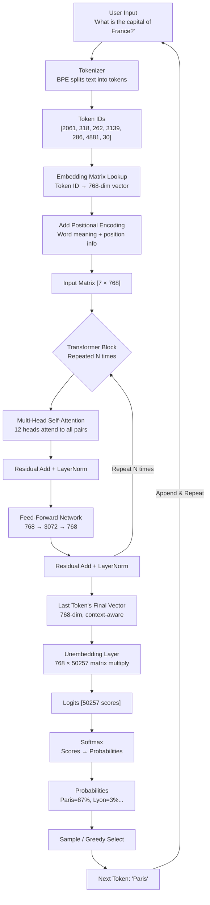

# LLM Mastery for Beginners: From Zero to Understanding Transformers
### *Second Edition — Fully Enhanced & Reorganized*

> *Every confusing word explained. Every concept grounded in analogy. Every line of code annotated. Built like a textbook — prerequisites first, advanced concepts after.*

---

## 📚 Table of Contents

**PART 0 — BEFORE YOU BEGIN: THE VOCABULARY YOU MUST KNOW**
- [0.1 What Is a Label?](#01-what-is-a-label)
- [0.2 What Is a Class?](#02-what-is-a-class)
- [0.3 What Are Features?](#03-what-are-features)
- [0.4 What Is a Probability?](#04-what-is-a-probability)
- [0.5 What Is Softmax?](#05-what-is-softmax)
- [0.6 What Is a Learning Rate?](#06-what-is-a-learning-rate)
- [0.7 What Is a Parameter / Weight?](#07-what-is-a-parameter--weight)
- [0.8 What Is a Vector?](#08-what-is-a-vector)
- [0.9 What Is a Matrix?](#09-what-is-a-matrix)
- [0.10 The Math You Actually Need (Dot Products)](#010-the-math-you-actually-need-dot-products)

**PART 1 — THE FOUNDATION: HOW MACHINES LEARN**
- [1.1 What Is Machine Learning?](#11-what-is-machine-learning)
- [1.2 The Core Algorithm: Gradient Descent](#12-the-core-algorithm-gradient-descent)
- [1.3 Loss Functions — Measuring "Wrongness"](#13-loss-functions--measuring-wrongness)
- [1.4 Cross-Entropy Loss — The LLM Standard](#14-cross-entropy-loss--the-llm-standard)
- [1.5 Bayes' Theorem — The Probability Backbone](#15-bayes-theorem--the-probability-backbone)
- [1.6 The Naive Bayes Connection to Language Models](#16-the-naive-bayes-connection-to-language-models)

**PART 2 — WHAT IS AN LLM AND WHY IT MATTERS**
- [2.1 The Big Picture](#21-the-big-picture)
- [2.2 Why Is It Called "Large"?](#22-why-is-it-called-large)
- [2.3 Real-World Uses of LLMs](#23-real-world-uses-of-llms)

**PART 3 — EVOLUTION OF LANGUAGE MODELS**
- [3.1 Why Not Just Use Rules?](#31-why-not-just-use-rules)
- [3.2 Era 1: Recurrent Neural Networks (RNNs)](#32-era-1-recurrent-neural-networks-rnns)
- [3.3 Era 2: LSTMs — The Notepad with Sticky Notes](#33-era-2-lstms--the-notepad-with-sticky-notes)
- [3.4 Era 3: Transformers — The Game Changer](#34-era-3-transformers--the-game-changer)

**PART 4 — TOKENIZATION**
- [4.1 Why Computers Need Numbers](#41-why-computers-need-numbers)
- [4.2 What Is a Token?](#42-what-is-a-token)
- [4.3 Byte Pair Encoding (BPE) Algorithm](#43-byte-pair-encoding-bpe-algorithm)
- [4.4 Special Tokens](#44-special-tokens)
- [4.5 Context Window](#45-context-window)
- [4.6 Using AutoTokenizer (Annotated Code)](#46-using-autotokenizer-annotated-code)

**PART 5 — EMBEDDINGS & VECTORIZATION**
- [5.1 The Problem With Raw Token IDs](#51-the-problem-with-raw-token-ids)
- [5.2 What Is an Embedding?](#52-what-is-an-embedding)
- [5.3 The Magic of Vector Space (Word2Vec Algorithm)](#53-the-magic-of-vector-space-word2vec-algorithm)
- [5.4 Input Embeddings in Transformers](#54-input-embeddings-in-transformers)
- [5.5 Positional Encoding](#55-positional-encoding)

**PART 6 — THE TRANSFORMER ARCHITECTURE**
- [6.1 The Big Picture Diagram](#61-the-big-picture-diagram)
- [6.2 The Stack: How Many Layers?](#62-the-stack-how-many-layers)
- [6.3 Residual Connections & Layer Normalization](#63-residual-connections--layer-normalization)

**PART 7 — ENCODER VS DECODER**
- [7.1 Two Flavors of Transformer](#71-two-flavors-of-transformer)
- [7.2 Encoder-Only Models (BERT)](#72-encoder-only-models-bert)
- [7.3 Decoder-Only Models (GPT)](#73-decoder-only-models-gpt)
- [7.4 Encoder-Decoder Models (T5)](#74-encoder-decoder-models-t5)

**PART 8 — ATTENTION MECHANISMS**
- [8.1 The Core Idea](#81-the-core-idea)
- [8.2 The Classroom Analogy](#82-the-classroom-analogy)
- [8.3 How Self-Attention Works Step by Step](#83-how-self-attention-works-step-by-step)
- [8.4 Multi-Head Attention](#84-multi-head-attention)
- [8.5 Causal Masking](#85-causal-masking)

**PART 9 — FEED-FORWARD NETWORKS (MLPs)**
- [9.1 What Comes After Attention?](#91-what-comes-after-attention)
- [9.2 Structure of the FFN](#92-structure-of-the-ffn)
- [9.3 Activation Functions (GELU / ReLU)](#93-activation-functions-gelu--relu)

**PART 10 — UNEMBEDDING & SAMPLING**
- [10.1 The Unembedding Layer](#101-the-unembedding-layer)
- [10.2 Softmax in Detail (Revisited Here in Context)](#102-softmax-in-detail-revisited-here-in-context)
- [10.3 Sampling Strategies](#103-sampling-strategies)

**PART 11 — TRAINING LLMs**
- [11.1 The Core Training Objective](#111-the-core-training-objective)
- [11.2 The Training Loop (Step by Step)](#112-the-training-loop-step-by-step)
- [11.3 Optimizers — AdamW](#113-optimizers--adamw)
- [11.4 Training vs Inference](#114-training-vs-inference)
- [11.5 RLHF — Making LLMs Helpful](#115-rlhf--making-llms-helpful)

**PART 12 — HUGGING FACE IN PRACTICE**
- [12.1 What Is Hugging Face?](#121-what-is-hugging-face)
- [12.2 Method 1: pipeline() — Fully Annotated](#122-method-1-pipeline--fully-annotated)
- [12.3 Method 2: AutoTokenizer + AutoModel — Fully Annotated](#123-method-2-autotokenizer--automodel--fully-annotated)
- [12.4 Loading Large Models Efficiently](#124-loading-large-models-efficiently)

**PART 13 — COMPLETE END-TO-END FLOW**
- [13.1 Full Inference Walkthrough](#131-full-inference-walkthrough)
- [13.2 Mermaid Diagram](#132-mermaid-diagram)

**PART 14 — COMMON MISTAKES & PRO TIPS**

**PART 15 — QUICK REVISION CHEAT SHEET**

**PART 16 — NEXT STEPS**

---

# PART 0 — BEFORE YOU BEGIN: THE VOCABULARY YOU MUST KNOW

> *Before learning about LLMs, you need to understand the words that appear everywhere in AI. This section will save you hours of confusion. Read it carefully — these concepts appear in every single section that follows.*

---

## 0.1 What Is a Label?

A **label** is the **answer** or **correct output** for a given input in a training dataset.

> 💡 Think of it like a teacher's answer key. The question is the input, the answer key is the label.

**Examples:**

| Input (what the model sees) | Label (the correct answer) |
|---|---|
| Photo of a cat | `"cat"` |
| Email text "You won $1,000,000!" | `"spam"` |
| Movie review "This film was terrible" | `"negative"` |
| Sentence "The cat sat on the ___" | `"mat"` |

In LLMs, the label is simply **the next word in the sentence**. Every piece of text generates its own labels automatically — the label for word position N is just word N+1. This is why LLM training is called **self-supervised** — no human needs to write the labels.

```
Training sentence: "The quick brown fox"
                    ↑     ↑     ↑     ↑
Input:             "The" → Label: "quick"
Input:             "The quick" → Label: "brown"
Input:             "The quick brown" → Label: "fox"
```

---

## 0.2 What Is a Class?

A **class** is a **category** that something can belong to. When a model makes a prediction, it picks from a set of possible classes.

> 💡 Think of classes like the options in a multiple-choice question.

**Examples:**

| Task | Possible Classes |
|---|---|
| Email spam detection | `["spam", "not spam"]` — 2 classes |
| Sentiment analysis | `["positive", "negative", "neutral"]` — 3 classes |
| Handwritten digit recognition | `[0, 1, 2, 3, 4, 5, 6, 7, 8, 9]` — 10 classes |
| Next-word prediction in an LLM | Every word in the vocabulary — ~50,000 classes! |

When your model has 2 classes → **binary classification**.
When your model has 3+ classes → **multi-class classification**.

In LLMs, next-word prediction is a classification problem with **50,000+ classes** — one class per vocabulary token.

---

## 0.3 What Are Features?

**Features** are the **input measurements or characteristics** that a model uses to make a prediction.

> 💡 Features are what you *give* the model. Labels are what you want the model to *predict*.

**Everyday analogy:** You're predicting if it will rain tomorrow. Your features might be: temperature, humidity, cloud cover, wind speed. You're using these measurements (features) to predict "rain" or "no rain" (the label).

**In machine learning:**

| Task | Features (inputs) | Label (output) |
|---|---|---|
| House price prediction | Square footage, bedrooms, location, age | Price in dollars |
| Spam detection | Word frequencies, sender, subject line | spam / not spam |
| LLM next-word prediction | All the token embeddings in the context | The next token |

**In neural networks and LLMs specifically:**
- Features start as raw inputs (token IDs)
- They get transformed into richer representations as they pass through layers
- By the final layer, each token's representation is a very sophisticated **feature vector** capturing meaning, context, syntax, and relationships

---

## 0.4 What Is a Probability?

A **probability** is a number between 0 and 1 that tells you **how likely** something is.

- **0** = impossible (will never happen)
- **1** = certain (will definitely happen)
- **0.5** = 50/50 chance

**Key rule:** When you list probabilities for *all possible outcomes*, they must **add up to exactly 1.0**.

```
Weather tomorrow:
  Rain:    0.60  (60% chance)
  Sunny:   0.30  (30% chance)
  Cloudy:  0.10  (10% chance)
  ─────────────
  Total:   1.00  ✅ (must sum to 1)
```

**In LLMs:**

After processing your input text, the model assigns a probability to **every token in its vocabulary** as the next token:

```
Given "The cat sat on the ___":
  "mat"    → 0.42  (42% likely)
  "floor"  → 0.24  (24% likely)
  "ground" → 0.18  (18% likely)
  "roof"   → 0.04  (4% likely)
  ... (49,996 more tokens with tiny probabilities)
  ─────────────────────────────
  Total:    1.00  ✅
```

The model then either picks the highest probability token, or **samples** randomly according to these probabilities (more on this in Part 10).

---

## 0.5 What Is Softmax?

**Softmax** is a mathematical function that converts a list of **any numbers** (positive or negative, large or small) into a list of **probabilities that sum to 1.0**.

> 💡 Softmax is the "probability-ifier" — you give it raw scores, it gives you proper probabilities.

**Why do we need it?**
After the model processes your input, it produces raw scores called **logits** — these are just numbers like `[8.2, 3.1, 6.7, -2.4]`. They don't naturally add up to 1. Softmax converts them into probabilities.

**The formula:**

```
softmax(xᵢ) = e^xᵢ / Σ(e^xⱼ)    for all j
```

That's just:
- Take e (≈2.718) to the power of each score
- Divide each result by the sum of all results

**Step-by-step example:**

```
Raw logit scores (just 4 tokens to keep it simple):
  "mat"    → 8.2
  "floor"  → 3.1
  "ground" → 6.7
  "roof"   → 2.4

Step 1 — Apply e^x to each:
  e^8.2  = 3,641
  e^3.1  = 22
  e^6.7  = 812
  e^2.4  = 11

Step 2 — Sum them:
  3,641 + 22 + 812 + 11 = 4,486

Step 3 — Divide each by the sum:
  "mat"    → 3,641 / 4,486 = 0.811  (81.1%)  ← highest score wins!
  "floor"  → 22    / 4,486 = 0.005  (0.5%)
  "ground" → 812   / 4,486 = 0.181  (18.1%)
  "roof"   → 11    / 4,486 = 0.002  (0.2%)
  ─────────────────────────────────
  Total:                     1.000  ✅
```

**Key properties of Softmax:**
- Always produces values between 0 and 1
- All outputs always sum to exactly 1
- **The largest input gets the largest probability** (but not all of it)
- The gap between scores gets amplified — small differences in logits become larger differences in probabilities
- If you add a constant to ALL logits, the probabilities don't change (only *relative* differences matter)

> 🧠 **Analogy:** Imagine 4 students competing for a prize. Their raw test scores are 82, 31, 67, 24. Softmax is like converting these scores into "probability of winning" — the student who scored 82 gets the biggest share of the prize money (81%), but it's not winner-take-all.

---

## 0.6 What Is a Learning Rate?

The **learning rate** is a small number that controls **how big of a step** the model takes when updating its parameters during training.

> 💡 Think of the learning rate as the "step size" when you're learning to ride a bike. Too big = you crash (overshoot). Too small = you never get moving. Just right = smooth learning.

**The visual intuition:**

Imagine you're trying to find the lowest point in a hilly landscape (the minimum of the loss function). You can only take steps — you can't see the whole map. The learning rate controls how far each step is:

```
Too large learning rate (e.g., 1.0):
  🧍→→→→→→ 💥 (overshoot the valley, crash into the other hill)
  Loss bounces up and down, never converges

Too small learning rate (e.g., 0.0000001):
  🧍→ (barely moves)
  Takes forever to train, might get stuck

Just right (e.g., 0.0003):
  🧍→→→→✓ (smoothly descends into the valley)
  Converges to good solution in reasonable time
```

**Typical learning rates for LLMs:**
- Pre-training GPT-3: 6×10⁻⁵ (that's 0.00006)
- Fine-tuning small models: 1×10⁻⁴ to 3×10⁻⁴
- Fine-tuning large models: 1×10⁻⁵ to 1×10⁻⁴

**Learning Rate Schedule:**
In practice, we don't use a fixed learning rate the whole time:
1. **Warmup phase:** Start from nearly zero, gradually increase to the target LR
2. **Stable phase:** Train at the target LR
3. **Decay phase:** Gradually reduce the LR toward the end

This prevents the model from making wild jumps at the start (when it's clueless) and helps it fine-tune precisely near the end.

---

## 0.7 What Is a Parameter / Weight?

A **parameter** (also called a **weight**) is a number inside the neural network that gets **adjusted during training** to make the model better.

> 💡 Think of parameters like the knobs on an equalizer (EQ) in music software. Each knob controls one aspect of the sound. Training = finding the perfect setting for every knob.

**Where do parameters live?**
- In the **embedding matrix** (maps token IDs to vectors)
- In the **attention matrices** (Q, K, V weight matrices)
- In the **feed-forward layers** (the MLP weight matrices)
- In the **unembedding matrix** (maps vectors back to vocab)

**When someone says "GPT-3 has 175 billion parameters," they mean:**
There are 175,000,000,000 individual numbers in the model, all tuned during training.

**Bias terms:** Each layer also has **biases** — extra parameters added after the weight multiplication. Think of bias as the "default value" when all inputs are zero.

```
y = W × x + b
      ↑           ↑
  weights (W)   bias (b)
  learned        learned
```

---

## 0.8 What Is a Vector?

A **vector** is simply **a list of numbers**.

```
A 3-dimensional vector:   [0.5, -1.2, 0.8]
A 5-dimensional vector:   [0.2, 0.9, -0.4, 1.1, 0.0]
A 768-dimensional vector: [0.12, -0.43, 0.87, 0.33, ..., 0.55]  ← LLM embedding
```

**Why does direction matter?**
In machine learning, vectors represent **points in space**. Two vectors that point in similar directions represent similar things (like "cat" and "dog"). Two vectors pointing in opposite directions are very different (like "cat" and "skyscraper").

> 🧠 **Analogy:** A city's address can be described as a 2D vector: (street_number, avenue_number). Two nearby addresses have similar vectors. An embedding is the same idea — but in 768 dimensions instead of 2.

---

## 0.9 What Is a Matrix?

A **matrix** is a **table of numbers** — a 2D grid with rows and columns.

```
A 3×3 matrix:
  [ 1,  2,  3 ]
  [ 4,  5,  6 ]
  [ 7,  8,  9 ]

The Embedding Matrix (50,257 × 768):
  Row 0:   [0.12, -0.43, ..., 0.55]   ← embedding for token 0
  Row 1:   [0.44, 0.21, ..., -0.32]  ← embedding for token 1
  ...
  Row 50256: [...]                    ← embedding for last token
```

**Matrix multiplication** is how neural networks transform one vector into another. When a vector (your token embedding) is multiplied by a weight matrix, it produces a new, transformed vector.

---

## 0.10 The Math You Actually Need (Dot Products)

The **dot product** of two vectors is: multiply each pair of corresponding numbers and sum them all up.

```
Vector A: [1, 2, 3]
Vector B: [4, 5, 6]

Dot product = (1×4) + (2×5) + (3×6)
            = 4 + 10 + 18
            = 32
```

**Why this matters:**
- High dot product = vectors point in the same direction = similar meaning
- Low/negative dot product = vectors point in different directions = different meaning
- The attention mechanism uses dot products to calculate how relevant two tokens are to each other

> 💡 The entire "magic" of attention is just a bunch of dot products, a softmax, and a weighted sum. That's it.

---

> ### 📌 Part 0 Summary — The Six Core Words
>
> | Word | One-Sentence Definition |
> |---|---|
> | **Label** | The correct answer the model is trying to predict |
> | **Class** | A category the model can predict (one of many possible answers) |
> | **Features** | The input data/measurements the model uses to make predictions |
> | **Probability** | A number 0–1 showing how likely something is; all options sum to 1 |
> | **Softmax** | A function that converts raw scores (logits) into probabilities |
> | **Learning Rate** | How big a step the model takes when updating parameters during training |
> | **Parameter/Weight** | A number inside the model that gets tuned during training |
> | **Vector** | A list of numbers representing a point in multi-dimensional space |

---

# PART 1 — THE FOUNDATION: HOW MACHINES LEARN

> *Before understanding LLMs, you need to understand *how* machines learn at all. This part explains the three core algorithms that power every neural network — including GPT-4, Claude, and every LLM ever built.*

---

## 1.1 What Is Machine Learning?

Traditional programming works like this:
```
Programmer writes rules → Computer follows rules → Output
```

Machine learning flips this:
```
Input data + Correct outputs → Computer figures out the rules → Model
```

> 💡 Instead of telling the computer *what* rules to use, you show it thousands of examples and let it **discover the rules itself**.

**Three types of machine learning:**

| Type | What It Needs | Example |
|---|---|---|
| **Supervised Learning** | Labeled data (input + correct label) | Spam filter (emails labeled spam/not spam) |
| **Unsupervised Learning** | Data only, no labels | Clustering similar customers together |
| **Self-Supervised Learning** | Data generates its own labels | LLMs predicting the next word |

LLMs use **self-supervised learning** — they don't need humans to label data. Every sentence on the internet automatically becomes training data where each word is the label for the previous words.

---

## 1.2 The Core Algorithm: Gradient Descent

**Gradient Descent** is the algorithm that *all* neural networks use to learn. It's how parameters get updated.

**The Goal:** Find the values of all parameters that minimize the loss (make the fewest mistakes).

**The intuition:**

Imagine you're blindfolded on a hilly landscape, trying to find the lowest valley. You can only feel the slope under your feet. Your strategy:
1. Feel which direction slopes downward
2. Take a step in that direction
3. Repeat until you stop going down

That's gradient descent. The "slope" is the **gradient** (calculated by backpropagation). Each "step" is controlled by the **learning rate**.

```
New Parameter Value = Old Parameter Value − (Learning Rate × Gradient)
```

**Backpropagation** is the algorithm that calculates the gradient — it figures out "how much did each parameter contribute to the mistake?" This uses the **chain rule** from calculus, applied backward through the network.

```
Forward Pass:  Input → Model → Prediction → Loss
Backward Pass: Loss → Calculate Gradient → Update Every Parameter
```

> 🧠 **Analogy:** You bake a cake, it tastes too salty. You figure out: "Too much salt → add 10% less salt next time." The gradient is your measurement of "how salty it was." The learning rate is "how aggressively you reduce salt next attempt."

---

## 1.3 Loss Functions — Measuring "Wrongness"

A **loss function** (also called **cost function** or **objective function**) is a mathematical formula that measures **how wrong the model's prediction was**.

> 💡 The loss is a single number: high number = model is very wrong, low number = model is close to right. The goal of training is to minimize this number.

**Common loss functions:**

| Loss Function | Used When | Simple Explanation |
|---|---|---|
| **Mean Squared Error (MSE)** | Predicting numbers (regression) | Average of (prediction − truth)² |
| **Binary Cross-Entropy** | 2-class classification | Penalizes wrong yes/no predictions |
| **Categorical Cross-Entropy** | Multi-class classification | Penalizes wrong category predictions |
| **Cross-Entropy Loss** | Next-word prediction in LLMs | See next section |

---

## 1.4 Cross-Entropy Loss — The LLM Standard

**Cross-Entropy Loss** is the loss function used for all classification tasks — including next-word prediction in LLMs.

**The formula:**
```
Loss = − log(probability assigned to the correct class)
```

**Step-by-step example:**

The model sees "The cat sat on the" and needs to predict the next word.

```
Scenario A (model is confident and correct):
  Model says: P("mat") = 0.90, P("floor") = 0.08, P("roof") = 0.02
  Correct answer: "mat"
  Loss = −log(0.90) = −(−0.105) = 0.105   ← LOW loss, good prediction!

Scenario B (model is uncertain):
  Model says: P("mat") = 0.30, P("floor") = 0.40, P("roof") = 0.30
  Correct answer: "mat"
  Loss = −log(0.30) = −(−1.204) = 1.204   ← HIGHER loss

Scenario C (model is confident but WRONG):
  Model says: P("mat") = 0.02, P("floor") = 0.03, P("roof") = 0.95
  Correct answer: "mat"
  Loss = −log(0.02) = −(−3.912) = 3.912   ← VERY HIGH loss, punished hard!
```

**Why the negative log?**
- log(1) = 0 → perfect prediction = zero loss ✅
- log(0.5) = −0.693 → modest confidence = moderate loss
- log(0.01) = −4.605 → very wrong = huge loss 🔥
- The negative sign flips the negative log values to positive (loss should be positive)

**Perplexity** — You'll often see this in LLM benchmarks. It's just `e^(cross-entropy loss)`. Lower perplexity = better model.

---

## 1.5 Bayes' Theorem — The Probability Backbone

**Bayes' Theorem** is one of the most important ideas in all of statistics and AI. It tells you how to **update your beliefs based on new evidence**.

**The formula:**
```
P(A | B) = P(B | A) × P(A) / P(B)
```

In plain English:
```
P(A | B) = "Probability of A, given that B happened"

= [How often B happens when A is true]
  × [How often A is true in general]
  / [How often B happens in general]
```

**Real example:**

You get a positive test for a rare disease (affects 1% of people). The test is 95% accurate.

- P(Disease) = 0.01 (1% of population has it)
- P(Positive test | Disease) = 0.95 (test catches 95% of sick people)
- P(Positive test | No Disease) = 0.05 (5% false positive rate)

What's the actual probability you're sick given the positive test?

```
P(Disease | Positive) = P(Positive | Disease) × P(Disease) / P(Positive)

P(Positive) = P(Positive|Disease)×P(Disease) + P(Positive|No Disease)×P(No Disease)
             = 0.95×0.01 + 0.05×0.99
             = 0.0095 + 0.0495 = 0.059

P(Disease | Positive) = (0.95 × 0.01) / 0.059 = 0.0095 / 0.059 ≈ 0.161
```

**Only ~16% chance you're sick!** Despite a 95% accurate test. This is why Bayesian reasoning is so important.

**Why this matters for LLMs:**
Every time an LLM predicts the next word, it's implicitly computing:
```
P(next word | all previous words) 
```
This is a Bayesian conditional probability. The entire LLM is a machine for computing this.

---

## 1.6 The Naive Bayes Connection to Language Models

**Naive Bayes** was one of the *first* algorithms used for language tasks (spam detection, text classification). Understanding it shows you *where modern LLMs came from*.

**The "Naive" assumption:**
Naive Bayes assumes all features (words) are **independent of each other** — the presence of "free" doesn't affect the probability of "money" appearing in the same email. This is obviously wrong in real language, but it worked surprisingly well.

**Spam detection example:**

To classify "You won FREE MONEY! Click now!" as spam or not:

```
P(spam | words) ∝ P(spam) × P("won"|spam) × P("FREE"|spam) × P("MONEY"|spam) × ...

P(not spam | words) ∝ P(not spam) × P("won"|not spam) × P("FREE"|not spam) × ...

Pick whichever is higher → classification
```

**The evolution:**
- **Naive Bayes:** Assumes all words are independent (wrong, but fast and simple)
- **N-gram models:** Considers sequences of N words (captures local context)
- **RNNs:** Considers the whole sequence (but forgets distant context)
- **Transformers/LLMs:** Considers *all* relationships between *all* words simultaneously

Modern LLMs don't use the naive independence assumption at all — their attention mechanism explicitly models how every word depends on every other word.

---

# PART 2 — WHAT IS AN LLM AND WHY IT MATTERS

## 2.1 The Big Picture

Imagine you have a friend who has read *every book, website, article, and forum post on the internet*. You can ask this friend anything — write a poem, debug your code, explain quantum physics like you're five, or draft an email to your boss. That friend is a **Large Language Model (LLM)**.

An **LLM** is a neural network trained on massive amounts of text. Its training objective is simple: **predict the next token**. But when you train a big enough network on enough text, predicting the next word requires the model to learn so much about language, facts, reasoning, and context that it becomes *generally capable*.

> 💡 **Simple Definition:** An LLM is a computer program that predicts what words should come next — but it does this so well that it can hold conversations, write essays, and solve problems.

## 2.2 Why Is It Called "Large"?

| What's Large | What It Means |
|---|---|
| **Parameters** | Billions of numbers inside the model, all tuned during training |
| **Training Data** | Hundreds of billions of words from the internet, books, code, etc. |

| Model | Parameters |
|---|---|
| GPT-2 (2019) | 1.5 billion |
| GPT-3 (2020) | 175 billion |
| Llama 3 70B (2024) | 70 billion |
| GPT-4 (estimated) | ~1 trillion |

## 2.3 Real-World Uses of LLMs

- **ChatGPT / Claude / Gemini** — Conversational AI assistants
- **GitHub Copilot** — AI code completion
- **Google Search AI Overviews** — Summarizing search results
- **Medical Research** — Summarizing clinical papers
- **Legal Tech** — Contract review and analysis
- **Education** — Personalized tutoring and explanation

---

# PART 3 — EVOLUTION OF LANGUAGE MODELS

## 3.1 Why Not Just Use Rules?

Early AI tried **rule-based systems** — manual if-then rules. They failed because:
- Rules can't handle **ambiguity** ("I saw the man with the telescope" — who had it?)
- Rules can't handle **context** ("bank" means different things in different sentences)
- Maintaining rules for all of language is humanly impossible

So researchers turned to **machine learning** — learning rules from data.

---

## 3.2 Era 1: Recurrent Neural Networks (RNNs)

**RNNs** process text one word at a time, left to right, carrying a "memory state" forward:

```
"The"  → [RNN] → State₁
"cat"  → [RNN + State₁] → State₂
"sat"  → [RNN + State₂] → State₃
```

**The Vanishing Gradient Problem:**
When you run backpropagation through many time steps, the gradient (the training signal) gets multiplied by small numbers many times — and shrinks toward zero. By the time it reaches the early words, there's almost no gradient left. The model forgets what it read long ago.

> 🧠 **Analogy:** RNN is like a person reading subtitles — one word at a time, left to right. By the time they read the last subtitle, they've forgotten the first one.

---

## 3.3 Era 2: LSTMs — The Notepad with Sticky Notes

**LSTM (Long Short-Term Memory)** networks fixed the forgetting problem with a special **cell state** — a separate "long-term memory lane" that gradients can flow through without shrinking.

LSTMs have three **gates** (learned mechanisms that control information flow):

| Gate | Purpose | Analogy |
|---|---|---|
| **Forget Gate** | Decides what to erase from memory | Crumpling old notes |
| **Input Gate** | Decides what new info to add | Writing important things down |
| **Output Gate** | Decides what to use from memory right now | Reading from your notes |

**Still had problems:**
- Sequential processing → can't be parallelized → slow to train
- Still struggled with very long documents (thousands of words)
- Complex to implement and train

---

## 3.4 Era 3: Transformers — The Game Changer (2017)

The paper **"Attention Is All You Need"** (Vaswani et al., 2017, Google Brain) threw out sequential processing entirely.

**The big idea:** Instead of reading one word at a time, look at **all words simultaneously** and let each word figure out which other words are relevant to it.

```
RNN:         The → cat → sat → on → the → mat  (sequential, slow)

Transformer: [The, cat, sat, on, the, mat]       (all at once, fast)
              Every word attends to every other word simultaneously
```

| Feature | RNN/LSTM | Transformer |
|---|---|---|
| Processing | Sequential | Fully parallel |
| Long-range memory | Weak (vanishing gradient) | Perfect (direct attention) |
| GPU efficiency | Poor (can't parallelize) | Excellent |
| Scaling | Limited | Scales to trillions of params |
| Year | 1986 / 1997 | 2017 |

> 🧠 **Analogy:** An RNN reads a sentence like subtitles — one at a time. A Transformer reads the whole page at once, then figures out which sentences relate to which.

---

# PART 4 — TOKENIZATION

## 4.1 Why Computers Need Numbers

Computers only understand numbers — not letters. Before text enters an LLM, every character, word, and punctuation mark must become a number. This conversion is **tokenization**.

---

## 4.2 What Is a Token?

A **token** is the basic unit of text that the model works with. It can be:

| Token Type | Example |
|---|---|
| A whole word | `"cat"` → one token |
| A word fragment | `"unbelievable"` → `["un", "believ", "able"]` → 3 tokens |
| Punctuation | `"."` → one token |
| A space + word | `" cat"` → one token (note the space!) |
| A special marker | `"<|endoftext|>"` → one token |

**Tokenizer vocabulary:** A fixed set of ~50,000 tokens. Every possible input text is broken into combinations of these tokens.

> 🧠 **Analogy:** Tokens are like Scrabble tiles. You don't play whole words — you play tiles. Some tiles spell whole words ("cat"), others are syllables ("ing", "un"). The model thinks in tiles.

---

## 4.3 Byte Pair Encoding (BPE) Algorithm

**BPE** is how the tokenizer vocabulary is built. The algorithm:

**Step 1:** Start with individual characters as the vocabulary: `['a', 'b', 'c', ..., 'z', ' ', '.', ...]`

**Step 2:** On the entire training corpus, find the most frequently occurring pair of adjacent tokens.

**Step 3:** Merge that pair into a new single token and add it to the vocabulary.

**Step 4:** Repeat steps 2–3 until the vocabulary reaches the target size (e.g., 50,257 tokens).

```
Starting corpus: "low low low lower lower newest newest"

Initial tokens:  l-o-w l-o-w l-o-w l-o-w-e-r l-o-w-e-r n-e-w-e-s-t n-e-w-e-s-t

Most frequent pair: "l" + "o" → merge to "lo"
New corpus:      lo-w lo-w lo-w lo-w-e-r lo-w-e-r n-e-w-e-s-t n-e-w-e-s-t

Most frequent pair: "lo" + "w" → merge to "low"
New corpus:      low low low low-e-r low-e-r n-e-w-e-s-t n-e-w-e-s-t

...keep going...

Final vocabulary includes: "low", "lower", "newest", "est", "new", ...
```

**Result:** Common words → single tokens. Rare/unknown words → broken into familiar pieces. This means LLMs can handle *any* word — even ones invented after training.

---

## 4.4 Special Tokens

| Token | Name | Purpose |
|---|---|---|
| `[CLS]` | Classification token | Marks start of sequence in BERT |
| `[SEP]` | Separator | Separates two sentences in BERT |
| `[PAD]` | Padding | Makes all sequences the same length in a batch |
| `[MASK]` | Mask | Hidden word in BERT's training |
| `<\|endoftext\|>` | End of text | Marks document end in GPT |
| `<s>` / `</s>` | Start / End | Sequence boundaries |

**Why padding?** When training with batches of sentences, all sentences must be the same length. Shorter sentences get `[PAD]` tokens appended. The model learns to ignore these via the **attention mask**.

---

## 4.5 Context Window

The **context window** is the maximum number of tokens a model can process in one pass.

| Model | Context Window | ≈ Word Count |
|---|---|---|
| GPT-2 | 1,024 tokens | ~750 words |
| GPT-3 | 4,096 tokens | ~3,000 words |
| GPT-4 Turbo | 128,000 tokens | ~96,000 words |
| Claude 3 | 200,000 tokens | ~150,000 words |

> ⚠️ **Critical:** The attention mechanism is **O(n²)** — if you double the context length, you quadruple the computation. Longer context windows are exponentially more expensive.

---

## 4.6 Using AutoTokenizer (Annotated Code)

```python
from transformers import AutoTokenizer
# AutoTokenizer is a factory class — it automatically detects
# what type of tokenizer the model uses (BPE, WordPiece, SentencePiece, etc.)
# and loads the correct one. You don't need to know the tokenizer type.

# ── LOADING ──────────────────────────────────────────────────────────
tokenizer = AutoTokenizer.from_pretrained("gpt2")
# from_pretrained("gpt2") does the following:
#   1. Looks up "gpt2" on the Hugging Face Hub
#   2. Downloads the tokenizer config (tokenizer_config.json)
#   3. Downloads the vocabulary file (vocab.json) — the ~50,257 token list
#   4. Downloads the merges file (merges.txt) — the BPE merge rules
#   5. Caches them locally (~/.cache/huggingface/) for future use
#   On subsequent runs, it loads from cache (no re-download)

text = "The cat sat on the mat."

# ── TOKENIZING ───────────────────────────────────────────────────────
tokens = tokenizer.tokenize(text)
# tokenize() splits the text into token strings (NOT IDs yet)
# It applies the BPE algorithm: looks up each word in vocab, 
# and if not found, splits it into sub-word pieces per merge rules
# Note: 'Ġ' is how HuggingFace represents a space before a token
print(tokens)
# Output: ['The', 'Ġcat', 'Ġsat', 'Ġon', 'Ġthe', 'Ġmat', '.']
# Each 'Ġ' = there was a space before this word in the original text

# ── ENCODING (text → IDs) ────────────────────────────────────────────
ids = tokenizer.encode(text)
# encode() does tokenize() + converts each token string to its integer ID
# by looking it up in the vocabulary dictionary (token_string → integer)
# This is what actually gets fed into the model — just integers
print(ids)
# Output: [464, 3797, 3332, 319, 262, 2603, 13]

# ── FULL ENCODING with extra info ────────────────────────────────────
encoded = tokenizer(text, return_tensors="pt")
# tokenizer() (calling the tokenizer as a function) is the main API
# return_tensors="pt" → return PyTorch tensors instead of Python lists
#   "pt" = PyTorch, "tf" = TensorFlow, "np" = NumPy, None = plain list
# Returns a dictionary-like object with:
print(encoded)
# {
#   'input_ids':      tensor([[464, 3797, 3332, 319, 262, 2603, 13]])
#                     ↑ the token IDs — shape: [batch_size, sequence_length]
#   'attention_mask': tensor([[1, 1, 1, 1, 1, 1, 1]])
#                     ↑ 1 = real token (pay attention), 0 = padding (ignore)
# }

# ── DECODING (IDs → text) ────────────────────────────────────────────
decoded = tokenizer.decode(ids)
# decode() reverses encode(): converts integer IDs back to a text string
# It looks up each ID in the reverse vocabulary dictionary (integer → token_string)
# and joins them, reconstructing the original text
print(decoded)
# Output: "The cat sat on the mat."

# ── BATCH ENCODING (multiple texts at once) ──────────────────────────
texts = ["Hello world", "The cat sat"]
batch = tokenizer(
    texts,
    padding=True,       # Adds [PAD] tokens to shorter sequences to match longest
    truncation=True,    # Cuts sequences longer than max_length
    max_length=512,     # Maximum sequence length (model-specific limit)
    return_tensors="pt" # Return PyTorch tensors
)
# "Hello world" might be length 2, "The cat sat" length 3
# After padding: both become length 3
# attention_mask will be [1,1,0] for "Hello world" (last token is padding, ignore it)

# ── CHECKING VOCABULARY SIZE ─────────────────────────────────────────
print(tokenizer.vocab_size)  # 50257 for GPT-2
# This is the number of unique tokens the model knows
# = number of rows in the embedding matrix
# = number of output classes in next-token prediction

# ── CHECKING CONTEXT WINDOW ──────────────────────────────────────────
print(tokenizer.model_max_length)  # 1024 for GPT-2
# This is the maximum number of tokens the model can process at once
# Inputs longer than this MUST be truncated or chunked
```

---

> ### 📌 Key Memorize Points — Tokenization
> - Tokenization converts text → token IDs (integers) for the model
> - Tokens are sub-word units; ~1 token ≈ 0.75 English words
> - BPE builds the vocabulary by greedily merging the most frequent character pairs
> - `tokenizer.encode()` → IDs; `tokenizer.decode()` → text; `tokenizer()` → full dict with masks
> - The attention mask tells the model which tokens are real (1) vs padding (0)

---

# PART 5 — EMBEDDINGS & VECTORIZATION

## 5.1 The Problem With Raw Token IDs

After tokenization, we have numbers like `[464, 3797, 3332]`. But these are just *labels* — they carry no meaning. Token 464 is not "greater than" or "related to" token 463. We need a richer representation.

**The problem with one-hot encoding (the naive approach):**

A naive way to represent token 464 would be a vector of 50,257 zeros with a single 1 at position 464:
```
Token 464: [0, 0, ..., 0, 1, 0, ..., 0]  ← 50,257 numbers, mostly zeros
```

This has two problems:
1. **Huge:** Each token needs a 50,257-dimensional vector
2. **No meaning:** "cat" (token 464) and "dog" (token 499) are equally distant from each other, even though they're conceptually similar

The solution: **embeddings**.

---

## 5.2 What Is an Embedding?

An **embedding** is a dense vector (small, all non-zero) that captures the *meaning* of a token. Tokens with similar meanings get similar vectors.

```
One-hot (bad):    cat  = [0, 0, 0, 1, 0, 0, ..., 0]  (50,257 dims, mostly zeros)
Embedding (good): cat  = [0.2, -0.5, 0.8, 0.1, ..., 0.3]  (768 dims, all meaningful)
                  dog  = [0.2, -0.4, 0.7, 0.2, ..., 0.4]  (similar to cat!)
                  car  = [-0.8, 0.9, -0.1, 0.6, ..., -0.2] (very different)
```

The embedding matrix is learned during training — the model figures out the best vectors to represent each token.

---

## 5.3 The Magic of Vector Space (Word2Vec Algorithm)

**Word2Vec** (2013, Google) was the first algorithm to demonstrate that embeddings capture semantic relationships. It's not used in modern LLMs directly, but it pioneered the embedding concept.

**The Word2Vec idea:** Train a shallow neural network to predict:
- "Skip-gram": given a word, predict its neighbors
- "CBOW": given neighbors, predict the center word

After training, the internal weight vectors (embeddings) happened to encode semantic meaning.

**The famous result:**
```
King  − Man  + Woman ≈ Queen
Paris − France + Germany ≈ Berlin
Running − Run + Walk ≈ Walking
```

This shows the embedding space has learned meaningful *directions*:
- There's a "gender direction" (King → Queen = Male → Female)
- There's a "capital city direction" (Paris → Berlin = France → Germany)

**Modern LLMs don't use Word2Vec** — their embeddings are learned end-to-end during transformer training, making them far richer. But the conceptual insight (words as vectors, meaning as direction) remains.

---

## 5.4 Input Embeddings in Transformers

The **embedding matrix** is a lookup table: given a token ID, return its embedding vector.

```
Embedding Matrix Shape: [vocab_size × embedding_dim]
                       = [50,257 × 768]   for GPT-2
                       = ~38.6 million parameters

Token ID 464 → Look up Row 464 → [0.12, -0.43, 0.87, ..., 0.55]
                                   ↑ 768 numbers, all meaningful
```

This is literally just an array lookup — incredibly fast. The "learning" happens during training when these row values get adjusted via gradient descent.

---

## 5.5 Positional Encoding

**The problem:** Looking up all token embeddings gives us no information about order. "The cat sat" and "Sat cat the" would produce the exact same set of embeddings (just in different order, which the model can't distinguish from inside).

**The solution:** Add a **positional encoding** vector to each token embedding.

```
Final Input Vector = Token Embedding + Positional Encoding

Position 0 ("The"):  [0.12, -0.43, ..., 0.55]   (token embedding)
                   + [0.00,  1.00, ..., 0.00]   (position 0 signal)
                   = [0.12,  0.57, ..., 0.55]   ← fed into transformer

Position 1 ("cat"): token embedding + position_1_signal
Position 2 ("sat"): token embedding + position_2_signal
...
```

**Two types:**

**Sinusoidal (original Transformer paper):** Fixed mathematical formula using sine/cosine waves of different frequencies. No parameters needed.
```
PE(pos, 2i)   = sin(pos / 10000^(2i/d_model))
PE(pos, 2i+1) = cos(pos / 10000^(2i/d_model))
```
Each position gets a unique pattern of sine waves — like a unique "fingerprint" for each position.

**Learned Positional Encodings (modern LLMs):** The position vectors themselves are parameters, learned during training alongside everything else. The model figures out the best way to encode position.

**RoPE (Rotary Positional Encoding):** Used in Llama, Mistral, and most modern open-source LLMs. Instead of adding positional vectors, it *rotates* the Q and K vectors by an angle proportional to position before computing attention. This has better length generalization (works for sequences longer than seen during training).

---

> ### 📌 Key Memorize Points — Embeddings
> - Embeddings are **dense vectors** that represent token meaning (not sparse one-hot vectors)
> - The **embedding matrix** maps each token ID to a vector (it's a learned lookup table)
> - Similar words get **similar vectors** — meaning is encoded in direction and distance
> - **Positional encoding** adds order information — without it, the model is word-order-blind
> - Final input = **Token Embedding + Positional Encoding**

---

# PART 6 — THE TRANSFORMER ARCHITECTURE

## 6.1 The Big Picture Diagram

```
INPUT TEXT: "The cat sat on the mat"
    │
    ▼  ① TOKENIZATION
    │  "The"=464, " cat"=3797, " sat"=3332, " on"=319, " the"=262, " mat"=2603
    │
    ▼  ② EMBEDDING LOOKUP + POSITIONAL ENCODING
    │  Each token ID → 768-dim vector + position vector
    │  Result: Matrix of shape [6 tokens × 768 dimensions]
    │
    ▼  ③ ENTER TRANSFORMER STACK
    │
    ╔═══════════════════════════════════════════════════════════════╗
    ║  TRANSFORMER BLOCK × N  (N = 12 for GPT-2, 96 for GPT-3)    ║
    ║                                                               ║
    ║  ┌───────────────────────────────────────────────────────┐   ║
    ║  │  MULTI-HEAD SELF-ATTENTION                            │   ║
    ║  │  • Each token generates Q, K, V vectors               │   ║
    ║  │  • Every token attends to every other token           │   ║
    ║  │  • Produces context-aware representation per token    │   ║
    ║  └───────────────────────────────────────────────────────┘   ║
    ║           │                                                   ║
    ║           ▼                                                   ║
    ║    [Residual Add + Layer Norm]                                ║
    ║           │                                                   ║
    ║  ┌───────────────────────────────────────────────────────┐   ║
    ║  │  FEED-FORWARD NETWORK (MLP)                           │   ║
    ║  │  • Applied independently to each token position       │   ║
    ║  │  • 768 → 3072 → 768 (expand 4×, then compress)       │   ║
    ║  │  • Stores and retrieves factual knowledge             │   ║
    ║  └───────────────────────────────────────────────────────┘   ║
    ║           │                                                   ║
    ║    [Residual Add + Layer Norm]                                ║
    ║                                                               ║
    ╚═══════════════════════════════════════════════════════════════╝
    │
    ▼  ④ FINAL HIDDEN STATE (last token's representation)
    │  A single 768-dim vector carrying all context
    │
    ▼  ⑤ UNEMBEDDING LAYER
    │  768-dim vector × Unembedding Matrix [768 × 50257]
    │  = 50,257 raw scores (logits) — one per vocabulary token
    │
    ▼  ⑥ SOFTMAX
    │  Converts logits to probabilities (all sum to 1.0)
    │
    ▼  ⑦ SAMPLING / GREEDY SELECT
    │  Pick next token based on probabilities
    │
OUTPUT TOKEN → append to input → repeat for next token
```

---

## 6.2 The Stack: How Many Layers?

| Model | Layers | Embedding Dim | Attention Heads | Parameters |
|---|---|---|---|---|
| GPT-2 Small | 12 | 768 | 12 | 117M |
| GPT-2 XL | 48 | 1600 | 25 | 1.5B |
| GPT-3 | 96 | 12,288 | 96 | 175B |
| BERT Base | 12 | 768 | 12 | 110M |
| Llama 3 8B | 32 | 4096 | 32 | 8B |

---

## 6.3 Residual Connections & Layer Normalization

**Residual Connections (Skip Connections):**

Without residual connections, deep networks suffer from vanishing/exploding gradients — the training signal becomes too small or too large to be useful.

The fix: after each sub-layer, **add the original input back to the output**.

```
Without residual:   output = SubLayer(input)
With residual:      output = SubLayer(input) + input   ← "skip" the sub-layer
```

> 🧠 **Analogy:** Imagine reading and summarizing a document. Without residuals, you only keep your summary. With residuals, you keep your summary *plus* the original document. You never lose information — you can always refer back to what you started with.

This allows gradients to flow directly through the "shortcut path" during backpropagation, enabling very deep networks (96+ layers) to train successfully.

**Layer Normalization:**

After each sub-layer (attention and FFN), we normalize the values:
```
LayerNorm(x) = γ × (x − mean(x)) / std(x) + β
               ↑                              ↑
           learned scale               learned shift
```

This ensures the numbers flowing through the network stay in a reasonable range (not too large, not too small). Without it, values in deep networks tend to explode or vanish.

> 🧠 **Analogy:** Layer Norm is like adjusting the volume on each speaker in a concert. No matter how loud or quiet the raw signal, everything comes out at a healthy level.

---

# PART 7 — ENCODER VS DECODER

## 7.1 Two Flavors of Transformer

The original 2017 Transformer had both an encoder and decoder. Researchers later discovered you could use just one part, leading to three model families:

## 7.2 Encoder-Only Models (BERT)

**BERT (Bidirectional Encoder Representations from Transformers)** — Google, 2018.

The encoder uses **bidirectional attention** — every token can attend to all other tokens in both directions simultaneously.

```
Input:  "The cat [MASK] on the mat"
                   ↑
        BERT looks LEFT and RIGHT from every position

For [MASK]:
  ← looks at "The", "cat"       (left context)
  → looks at "on", "the", "mat" (right context)
  Predicts: "sat" (best fits both left and right context)
```

**Training method:** **Masked Language Modeling (MLM)** — randomly hide 15% of tokens, train the model to predict them.

**Best for:** Understanding tasks where you need to process the full input before deciding:
- Text classification (positive/negative)
- Named Entity Recognition (is "Paris" a city or a person?)
- Question answering (find the answer span in a passage)

---

## 7.3 Decoder-Only Models (GPT)

**GPT (Generative Pre-trained Transformer)** — OpenAI, 2018.

The decoder uses **causal (unidirectional) attention** — each token can only attend to tokens that came *before* it. This is enforced by a mask.

```
Input:  "The cat sat on the"
        →→→→→→→→→→→→→→→→→
        GPT only looks LEFT (can't see future words)

For "the" (position 5):
  ✅ can see: "The", "cat", "sat", "on"
  ❌ cannot see: any future tokens (there are none yet)
  Predicts: "mat" as the next word
```

**Training method:** **Causal Language Modeling (CLM)** — predict the next token given all previous tokens.

**Best for:** Generation tasks where you produce output word by word:
- Chatbots, text generation
- Code completion
- Story writing

---

## 7.4 Encoder-Decoder Models (T5, BART)

Uses both components:
- Encoder reads the full input with bidirectional attention
- Decoder generates the output autoregressively, attending to both the decoder's own past output AND the encoder's final representation

**Best for:** Sequence-to-sequence tasks:
- Machine translation
- Abstractive summarization (paraphrase the content, not copy it)

**Quick Comparison:**

| Feature | Encoder (BERT) | Decoder (GPT) | Enc-Dec (T5) |
|---|---|---|---|
| Attention | Bidirectional | Causal (left-only) | Both |
| Primary strength | Understanding | Generating | Transforming |
| Training task | Masked LM | Next token prediction | Span denoising |
| Examples | BERT, RoBERTa | GPT-4, Claude, Llama | T5, BART |

---

# PART 8 — ATTENTION MECHANISMS

## 8.1 The Core Idea

**Attention** solves the question: *"For understanding this word, which other words in the sentence should I look at?"*

The key insight: the **relevance between two words should be learned from data**, not hardcoded by rules.

---

## 8.2 The Classroom Analogy

> 🧠 Imagine a classroom where 10 students are working on an exam. The question is: "What does 'it' refer to in: 'The trophy didn't fit in the suitcase because it was too big'?"
>
> - The student working on "it" needs to look around and ask: "Who knows what I'm referring to?"
> - They turn to the "trophy" student (high attention — makes sense!)
> - They glance at the "suitcase" student (medium attention — possible too)
> - They barely look at "the" or "because" (near-zero attention — not relevant)
>
> The student on "it" then *borrows* information from the trophy student to update their understanding: "it = trophy."
>
> This is **self-attention** — every word (student) actively seeks out the most relevant other words (classmates) and borrows their knowledge.

---

## 8.3 How Self-Attention Works Step by Step

### Step 1: Create Q, K, V Vectors

For each token, multiply its embedding by three different learned weight matrices to get three different vectors:

```
For token "cat" (embedding vector e_cat):

  Query  Q = e_cat × W_Q   ← "What am I looking for?"
  Key    K = e_cat × W_K   ← "What do I represent / what info do I hold?"
  Value  V = e_cat × W_V   ← "What info should I share if someone attends to me?"

W_Q, W_K, W_V are weight matrices — learned during training
```

> 🧠 **Search engine analogy:**
> - **Query** = your search query ("best pizza near me")
> - **Key** = the page titles in the index ("Mario's Pizza NYC", "Pizza Hut", "Health Food")
> - **Value** = the actual page content you get when you click

### Step 2: Calculate Attention Scores

For every pair of tokens (i attends to j), compute the dot product of Q_i and K_j:

```
Score(cat attends to The)   = Q_cat · K_The
Score(cat attends to cat)   = Q_cat · K_cat   (self-attention — yes, to itself too)
Score(cat attends to sat)   = Q_cat · K_sat
Score(cat attends to on)    = Q_cat · K_on
Score(cat attends to the)   = Q_cat · K_the
Score(cat attends to mat)   = Q_cat · K_mat
```

Higher dot product = more similar directions = higher relevance = more attention.

**Why divide by √d_k?**

Dot products grow with the dimension size. If d_k = 768, the dot products can get very large (in the hundreds). When you put large numbers into softmax, the output becomes extremely peaked (one token gets 99.99% of attention, all others get ~0%). Dividing by √d_k keeps the scores in a manageable range for softmax to work well.

```
Scaled Score = (Q_i · K_j) / √d_k
```

### Step 3: Apply Softmax to Get Attention Weights

Apply softmax across all the scores for one query token — this converts them into probabilities:

```
Scores for "cat" attending to all tokens:
  Raw:      [0.8, 2.1, 3.4, 0.2, 1.1, 2.8]

After softmax (each becomes a probability, all sum to 1.0):
  Weights:  [0.05, 0.18, 0.46, 0.03, 0.09, 0.38]
  Meaning:  "cat" pays:
              5% attention to "The"
             18% attention to "cat" (itself)
             46% attention to "sat"   ← highest!
              3% attention to "on"
              9% attention to "the"
             38% attention to "mat"   ← also high
```

### Step 4: Weighted Sum of Value Vectors

Take the weighted average of all Value vectors, using the attention weights:

```
New representation of "cat" = 
    0.05 × V("The")
  + 0.18 × V("cat")
  + 0.46 × V("sat")     ← contributes most
  + 0.03 × V("on")
  + 0.09 × V("the")
  + 0.38 × V("mat")     ← contributes second most
```

The "cat" token has now absorbed information about what it "sat" on (the "mat"). This is how context flows between tokens.

### The Formula

```
Attention(Q, K, V) = softmax( Q·Kᵀ / √d_k ) · V
                      ────────────────────     ↑
                             ↑              weighted
                         attention          average of
                          weights           values
```

---

## 8.4 Multi-Head Attention

Single-head attention learns one type of relationship. But sentences have *many* simultaneous relationship types:

- Syntactic: what's the subject of the verb?
- Semantic: what does this pronoun refer to?
- Positional: which nearby words are relevant?
- Topical: what's the document about?

**Multi-head attention** runs H independent attention mechanisms in parallel, each potentially learning a different type of relationship:

```
Input embeddings
    │
    ├──→ [Head 1: W_Q¹, W_K¹, W_V¹] → Attention output 1  (learns syntax?)
    ├──→ [Head 2: W_Q², W_K², W_V²] → Attention output 2  (learns coreference?)
    ├──→ [Head 3: W_Q³, W_K³, W_V³] → Attention output 3  (learns position?)
    │    ...
    └──→ [Head H: W_Qᴴ, W_Kᴴ, W_Vᴴ] → Attention output H
    
    All outputs concatenated: [output_1 | output_2 | ... | output_H]
    
    Linear projection back to d_model dimensions
    
    Final multi-head attention output
```

Each head has its own W_Q, W_K, W_V matrices — learned independently. Each head can (and does!) specialize in something different, though we can't always interpret what.

**Typical configurations:**

| Model | d_model | Heads | Head dim (d_k) |
|---|---|---|---|
| GPT-2 | 768 | 12 | 64 |
| GPT-3 | 12288 | 96 | 128 |
| BERT | 768 | 12 | 64 |

Note: `d_k = d_model / num_heads`

---

## 8.5 Causal Masking

In **decoder models** (GPT-style), the model must not see future tokens during training or inference — it would be "cheating." We enforce this with a **causal mask**:

```
Attention mask for "The cat sat" (decoder style):

         The   cat   sat
The    [ 1,    -∞,   -∞  ]   ← "The" can only attend to itself
cat  → [ 1,     1,   -∞  ]   ← "cat" can attend to "The" and "cat"
sat  → [ 1,     1,    1  ]   ← "sat" can attend to all three

The -∞ values → become 0 after softmax (e^(-∞) = 0)
```

During training, this mask lets us compute all positions' predictions in parallel (efficient!) while still preventing each position from "seeing" future tokens.

---

> ### 📌 Key Memorize Points — Attention
> - Attention = each token asks "which other tokens are relevant to me?" and borrows their info
> - **Q (Query):** "What am I looking for?" | **K (Key):** "What do I represent?" | **V (Value):** "What I'll share"
> - Attention score = **dot(Q, K) / √d_k** → softmax → weighted sum of V
> - **Multi-head** = run H independent attention mechanisms → concatenate → linear project
> - **Causal mask** in decoders blocks access to future tokens (sets scores to −∞)
> - Attention complexity = **O(n²)** — doubling sequence length quadruples computation

---

# PART 9 — FEED-FORWARD NETWORKS (MLPs)

## 9.1 What Comes After Attention?

After attention lets tokens share and gather information, the **Feed-Forward Network (FFN)** processes each token's representation independently. 

> 💡 Attention = gathering info from others. FFN = thinking about what you gathered.

---

## 9.2 Structure of the FFN

The FFN is a 2-layer neural network applied identically to each token position:

```
Input: x (shape: d_model = 768)
    │
    ▼
Linear Layer 1:  x → W₁x + b₁   (shape: 768 → 3072, expand 4×)
    │
    ▼
Activation (GELU):  nonlinear transformation — "which signals to keep?"
    │
    ▼
Linear Layer 2:  → W₂x + b₂   (shape: 3072 → 768, compress back)
    │
    ▼
Output: (shape: d_model = 768)
```

**Important:** The FFN is applied **position-wise** — it processes each token's vector independently, with no communication between positions. All communication between token positions happens in attention.

**The FFN as memory:**
Research (Geva et al., 2021) showed FFN layers behave like **key-value memories**:
- The first layer's rows act as "keys" — patterns that match certain concepts
- The second layer's columns act as "values" — what to output when a key fires
- When "Paris" is in context, specific FFN neurons activate and output France-related knowledge

> 🧠 **Analogy:** Attention is like asking your classmates for help. The FFN is like consulting your own personal encyclopedia — looking up relevant knowledge based on what you just heard from your classmates.

---

## 9.3 Activation Functions (GELU / ReLU)

Without a non-linear activation function, two linear layers are mathematically equivalent to one linear layer — no extra expressive power. The activation adds the crucial non-linearity.

**ReLU (Rectified Linear Unit)** — older, simpler:
```
ReLU(x) = max(0, x)

Input:  [-2, -1,  0,  1,  2,  3]
Output: [ 0,  0,  0,  1,  2,  3]
```
Negative values → zero (blocked). Positive values → pass through unchanged.

**GELU (Gaussian Error Linear Unit)** — used in BERT, GPT, most modern LLMs:
```
GELU(x) ≈ x × Φ(x)   where Φ is the Gaussian CDF
```
Unlike ReLU's hard zero-cutoff, GELU smoothly scales down negative values and slightly scales up positive ones. This smooth behavior helps with gradient flow during training.

```
ReLU:  ___/   (hard corner at 0)
GELU:  ___⌒/  (smooth curve near 0)
```

**SwiGLU** — used in Llama, Mistral, and many modern models:
```
SwiGLU(x, W, V, b, c) = Swish(xW + b) ⊗ (xV + c)
```
Involves two linear projections and element-wise multiplication. More expressive, but the theory of exactly why it works better is still being studied.

---

> ### 📌 Key Memorize Points — FFN
> - FFN = 2 linear layers with an activation function between them
> - Inner dimension = **4× the model dimension** (d_ff = 4 × d_model)
> - FFN processes **each token independently** — no cross-token communication
> - FFN layers store the model's **factual knowledge** (key-value memory interpretation)
> - Activation function (GELU/ReLU) adds non-linearity — without it, two linear layers = one linear layer

---

# PART 10 — UNEMBEDDING & SAMPLING

## 10.1 The Unembedding Layer

After the last Transformer block, each token position has a final hidden vector of shape `d_model`. For text generation, we care about the **last position's vector** — it represents everything the model knows about "what should come next."

**The unembedding step:**
```
Final hidden vector: h (shape: 768)
    │
    ▼
Multiply by Unembedding Matrix U (shape: 768 × 50,257)
    │
    ▼
Logits: l (shape: 50,257) — one raw score per vocabulary token

l = h × U
```

**Logits** are the raw output scores before softmax. The highest logit → most likely next token (before any sampling).

**Weight tying:** In many models, `U = Eᵀ` (the unembedding matrix is the transpose of the embedding matrix). They share the same weights! This halves parameter count and improves performance — the model uses the same "language" for input and output.

---

## 10.2 Softmax in Detail (Revisited in Context)

Now that you've seen softmax in Part 0, here's how it works in the full LLM context:

```
Logits (50,257 raw scores):
  "mat"    → 8.2   ← highest raw score
  "floor"  → 6.7
  "ground" → 5.1
  "the"    → 4.3
  "roof"   → 3.9
  ... (49,252 more tokens with lower/negative logits)

After softmax(logits / temperature):

At temperature = 1.0:
  "mat"    → 0.42  (42%)
  "floor"  → 0.21  (21%)
  "ground" → 0.11  (11%)
  ...

At temperature = 0.5 (sharper — more confident):
  "mat"    → 0.74  (74%)
  "floor"  → 0.15  (15%)
  ...

At temperature = 2.0 (flatter — more random):
  "mat"    → 0.22  (22%)
  "floor"  → 0.20  (20%)
  "ground" → 0.17  (17%)
  ...  ← distribution is more spread out, unusual words more likely
```

**Temperature formula:**
```
probabilities = softmax(logits / T)
```
- T < 1 → divide by small number → logits become larger relative differences → more peaked
- T = 1 → standard softmax
- T > 1 → divide by large number → logits squish toward each other → flatter distribution

---

## 10.3 Sampling Strategies

| Strategy | How It Works | Best For |
|---|---|---|
| **Greedy** | Always pick token with highest probability | Factual Q&A (deterministic) |
| **Temperature sampling** | Sample from full distribution, scaled by T | Creative writing |
| **Top-k** | Sample only from k highest probability tokens | Balanced quality/diversity |
| **Top-p (nucleus)** | Sample from fewest tokens whose probs sum to ≥ p | State-of-the-art quality |
| **Beam search** | Track B candidate sequences simultaneously | Translation, summarization |

**Top-p (nucleus) sampling explained:**

```
Sorted probabilities:
  "mat"    → 0.42   cumsum: 0.42
  "floor"  → 0.21   cumsum: 0.63
  "ground" → 0.11   cumsum: 0.74
  "the"    → 0.08   cumsum: 0.82
  "rug"    → 0.06   cumsum: 0.88
  "roof"   → 0.04   cumsum: 0.92  ← top-p=0.90 stops here
  ... (rest excluded)

With top-p = 0.90: only sample from {"mat", "floor", "ground", "the", "rug", "roof"}
Redistribute probabilities among these 6 tokens and sample.
```

Top-p adapts dynamically — when the model is confident (one token has 90% prob), it's almost greedy. When uncertain (many tokens share probability), it allows more diversity.

---

# PART 11 — TRAINING LLMs

## 11.1 The Core Training Objective

**Causal Language Modeling:** Given all previous tokens, predict the next token.

```
Training sentence: "The quick brown fox jumps"

From this one sentence, we automatically generate 4 training examples:
  Input: [The]                → Target label: "quick"
  Input: [The, quick]         → Target label: "brown"  
  Input: [The, quick, brown]  → Target label: "fox"
  Input: [The, quick, brown, fox] → Target label: "jumps"
```

Every token (except the first) becomes a training label for the tokens before it. One sentence = N−1 training examples. With billions of sentences, you get trillions of training examples — all generated automatically from raw text with zero human labeling. This is **self-supervised learning**.

---

## 11.2 The Training Loop (Step by Step)

```
REPEAT for millions of steps:

  1. SAMPLE: Pick a random batch of text sequences from training corpus
  
  2. TOKENIZE: Convert text to token IDs
  
  3. FORWARD PASS:
     tokens → embeddings → transformer blocks → logits → softmax → probabilities
     
  4. COMPUTE LOSS:
     For each position, look up the probability assigned to the correct next token
     Loss = −(1/N) × Σ log(P(correct token at position i))
     
  5. BACKWARD PASS (Backpropagation):
     Starting from the loss, calculate ∂Loss/∂(every parameter) using chain rule
     This gives a gradient for every one of the model's billions of parameters
     
  6. UPDATE PARAMETERS:
     For each parameter θ:
       θ_new = θ_old − learning_rate × gradient
     
  7. ZERO GRADIENTS:
     Clear gradient buffers (else they accumulate across batches)
     
  8. LOG metrics, checkpoint model occasionally
```

**Scale of GPT-3 training:**
- 300 billion tokens of training data
- ~3.14×10²³ floating point operations
- ~1,000 A100 GPUs for ~34 days
- Estimated cost: $4–12 million

---

## 11.3 Optimizers — AdamW

**Gradient descent** is the core idea, but plain gradient descent is slow and unstable. **Optimizers** are improved algorithms for updating parameters.

**SGD (Stochastic Gradient Descent)** — basic:
```
θ = θ − lr × gradient
```

**Adam (Adaptive Moment Estimation)** — used for almost all deep learning:

Adam tracks two additional statistics per parameter:
- **m** (first moment): running average of gradients (momentum — smooths noisy updates)
- **v** (second moment): running average of squared gradients (adapts learning rate per parameter)

```
m_t = β₁ × m_{t-1} + (1 − β₁) × gradient     (β₁ = 0.9 typically)
v_t = β₂ × v_{t-1} + (1 − β₂) × gradient²    (β₂ = 0.999 typically)

θ = θ − (lr / (√v_t + ε)) × m_t
```

**Why Adam is better:**
- Parameters with consistently large gradients get smaller updates (auto-reduced lr)
- Parameters with small or inconsistent gradients get relatively larger updates
- Momentum (m) smooths out noisy gradients
- Much faster convergence than plain SGD in practice

**AdamW** = Adam + **weight decay** (a regularization technique that gently shrinks all parameters toward zero each step, preventing them from growing too large). This is the standard for LLM training.

---

## 11.4 Training vs Inference

| Aspect | Training | Inference |
|---|---|---|
| What happens | Forward + Backward + Update | Forward pass only |
| Gradients | Computed (expensive) | Not computed (use `no_grad`) |
| Batch size | Large (hundreds to thousands) | Usually 1 |
| Randomness | Dropout active (random neurons disabled) | Dropout off (`model.eval()`) |
| Duration | Weeks to months | Milliseconds to seconds |
| Cost | $Millions | Fractions of a cent |
| Mode in code | `model.train()` | `model.eval()` |

**Dropout** (training technique): randomly zero out a fraction (e.g., 10–20%) of neurons during each forward pass. Forces the model to not rely too heavily on any single neuron. Turned OFF during inference.

---

## 11.5 RLHF — Making LLMs Helpful

Raw pre-trained LLMs are good at predicting text but not necessarily at being helpful, harmless, or honest. They might complete "How do I make a bomb?" by continuing the sentence naturally. RLHF fixes this.

**RLHF (Reinforcement Learning from Human Feedback) — 3 stages:**

```
Stage 1: Pre-training (unsupervised)
  Massive text data → predict next token → base model
  
Stage 2: Supervised Fine-tuning (SFT)
  Human-written (prompt, ideal response) pairs → fine-tune base model
  → SFT model (better at following instructions)

Stage 3: Reward Model Training
  Show human raters multiple model responses to same prompt
  Humans rank them: response A > response B > response C
  Train a separate "reward model" to predict human preference scores

Stage 4: PPO (Proximal Policy Optimization)
  Use the reward model to fine-tune the SFT model
  Model generates response → reward model scores it → 
  update model to produce higher-scored responses
  → RLHF model (ChatGPT, Claude, etc.)
```

**Direct Preference Optimization (DPO)** — newer, simpler alternative to RLHF that skips the explicit reward model and directly trains on preference pairs. Used by many modern open-source models.

---

# PART 12 — HUGGING FACE IN PRACTICE

## 12.1 What Is Hugging Face?

Hugging Face is the **GitHub of AI models** — an open platform providing:
- **Model Hub:** 500,000+ pre-trained models you can download and use
- **`transformers` library:** The standard Python library for working with all transformer models
- **Datasets library:** Thousands of pre-processed datasets
- **Spaces:** Host and demo your own AI apps

> 🧠 **Analogy:** If AI models are apps, Hugging Face is the App Store. Free to browse, most models are free to download, and anyone can publish.

---

## 12.2 Method 1: pipeline() — Fully Annotated

```python
from transformers import pipeline
# pipeline is a high-level abstraction that:
#   1. Infers the correct model class for the task
#   2. Downloads and caches the model + tokenizer
#   3. Handles preprocessing (tokenization, special tokens, padding)
#   4. Handles postprocessing (decoding, score formatting)
#   All of steps 1-4 are hidden behind one simple function call

# ── TEXT GENERATION ──────────────────────────────────────────────────
generator = pipeline(
    "text-generation",          # task name — tells pipeline what to do
    model="gpt2"                # model identifier from Hugging Face Hub
    # device=0                  # optionally: use GPU 0. Default is CPU
)
# Under the hood, this call:
#   1. Downloads gpt2's config.json (model architecture details)
#   2. Downloads model.safetensors (the actual weights, ~500MB)
#   3. Downloads tokenizer files (vocab.json, merges.txt)
#   4. Instantiates GPT2LMHeadModel (the model class)
#   5. Loads weights into the model
#   6. Sets model to eval() mode

result = generator(
    "Once upon a time",         # the input prompt
    max_new_tokens=50,          # generate at most 50 NEW tokens (not counting input)
    do_sample=True,             # True=sample from distribution, False=greedy (always pick max prob)
    temperature=0.8,            # controls randomness: <1=focused, >1=creative. Only used if do_sample=True
    top_p=0.9,                  # nucleus sampling: only sample from tokens whose cumulative prob ≥ 0.9
    num_return_sequences=1      # how many independent outputs to generate
)
# result is a list of dicts (one per num_return_sequences):
# [{'generated_text': 'Once upon a time, in a land far away...'}]
print(result[0]['generated_text'])


# ── SENTIMENT ANALYSIS ───────────────────────────────────────────────
classifier = pipeline(
    "sentiment-analysis"
    # No model specified → uses a default model (distilbert-base-uncased-finetuned-sst-2-english)
    # This is an ENCODER model (BERT-style), fine-tuned for classification
)
result = classifier("I absolutely love learning about AI!")
# Under the hood:
#   1. Tokenizes the input text → token IDs
#   2. Adds [CLS] and [SEP] special tokens (BERT requires these)
#   3. Forward pass through the model
#   4. Takes the [CLS] token's final representation
#   5. Passes through a classification head (linear layer → softmax)
#   6. Returns the class with highest probability + its score
print(result)
# [{'label': 'POSITIVE', 'score': 0.9998}]


# ── QUESTION ANSWERING ───────────────────────────────────────────────
qa = pipeline(
    "question-answering",
    model="deepset/roberta-base-squad2"  # fine-tuned BERT-style model for QA
)
result = qa(
    question="What is the capital of France?",
    context="France is a country in Western Europe. Paris is its capital and largest city."
)
# Under the hood:
#   1. Encodes [CLS] + question + [SEP] + context + [SEP] as one sequence
#   2. Model predicts: for each token position, 
#      P(this token is the start of the answer) and P(this token is the end)
#   3. Finds the span [start, end] with highest combined probability
#   4. Extracts and returns that text span
print(result)
# {'score': 0.99, 'start': 48, 'end': 53, 'answer': 'Paris'}


# ── SUMMARIZATION ────────────────────────────────────────────────────
summarizer = pipeline(
    "summarization",
    model="facebook/bart-large-cnn"  # BART is an encoder-decoder model
)
long_text = """
The Amazon rainforest covers over 5.5 million square kilometers across nine countries.
It is the world's largest tropical rainforest and is home to an estimated 10% of all 
species on Earth. The forest produces about 20% of the world's oxygen and plays a 
critical role in regulating the global climate. However, deforestation has eliminated 
approximately 17% of the Amazon in the last 50 years.
"""
result = summarizer(
    long_text,
    max_length=100,   # maximum length of the summary in tokens
    min_length=30,    # minimum length — prevents single-word summaries
    do_sample=False   # for summarization, greedy/beam search usually better than sampling
)
print(result[0]['summary_text'])
```

---

## 12.3 Method 2: AutoTokenizer + AutoModel — Fully Annotated

```python
import torch
from transformers import AutoTokenizer, AutoModelForCausalLM

# ── AUTO CLASSES ─────────────────────────────────────────────────────
# AutoTokenizer and AutoModelForCausalLM are "auto" classes:
# They read the model's config.json, find the correct class name,
# and automatically instantiate the right tokenizer/model class
# Example: config says "model_type": "gpt2" → uses GPT2Tokenizer, GPT2LMHeadModel

model_name = "gpt2"  # can be any model on the Hub, or a local path

# ── LOADING THE TOKENIZER ────────────────────────────────────────────
tokenizer = AutoTokenizer.from_pretrained(model_name)
# from_pretrained does:
#   1. Downloads tokenizer_config.json (specifies tokenizer class and settings)
#   2. Downloads vocab.json (token string → ID mapping, ~50,257 entries)
#   3. Downloads merges.txt (BPE merge rules, used to tokenize new text)
#   4. Caches to ~/.cache/huggingface/hub/
#   5. Instantiates GPT2Tokenizer with these files

# ── LOADING THE MODEL ────────────────────────────────────────────────
model = AutoModelForCausalLM.from_pretrained(model_name)
# from_pretrained does:
#   1. Downloads config.json (model architecture: n_layers=12, n_head=12, n_embd=768, etc.)
#   2. Downloads model.safetensors (~548MB, contains all 117M parameter values)
#   3. Instantiates GPT2LMHeadModel with the architecture from config
#   4. Loads parameter values from the .safetensors file into the model
#   5. model is now in "training mode" by default (dropout active)

model.eval()  
# Switches model to evaluation mode:
#   - Disables Dropout (random neuron zeroing used during training for regularization)
#   - Disables BatchNorm update (not relevant for Transformers, but good practice)
#   - Does NOT freeze parameters (model is still "on", just in inference mode)

# ── TOKENIZING INPUT ─────────────────────────────────────────────────
input_text = "The future of artificial intelligence is"

inputs = tokenizer(
    input_text,
    return_tensors="pt"  # "pt" = return PyTorch tensors (vs "np" for numpy, "tf" for TensorFlow)
)
# tokenizer() call does:
#   1. Applies BPE tokenization: text → list of token strings
#   2. Looks up each token string in vocab.json → list of integer IDs
#   3. Wraps in PyTorch tensors with a batch dimension added
# Returns a dict:
# {
#   'input_ids':      tensor([[464, 2003, 286, 11593, 4430, 318]])
#                     shape: [batch_size=1, sequence_length=6]
#   'attention_mask': tensor([[1, 1, 1, 1, 1, 1]])
#                     1 = real token, 0 = padding. All 1s here since no padding needed
# }

print(f"Input token IDs: {inputs['input_ids']}")
print(f"Sequence length: {inputs['input_ids'].shape[1]} tokens")

# ── GENERATING TEXT ──────────────────────────────────────────────────
with torch.no_grad():
    # torch.no_grad() is a context manager that:
    #   - Disables gradient computation for all operations inside
    #   - PyTorch normally builds a "computation graph" tracking all ops for backprop
    #   - During inference, we never backpropagate → no need for this graph
    #   - This saves ~50% memory and speeds up computation
    
    output_ids = model.generate(
        inputs["input_ids"],       # the encoded input tokens
        
        max_new_tokens=100,        # generate up to 100 NEW tokens
                                   # total output length = input_length + 100
        
        do_sample=True,            # True: sample from probability distribution
                                   # False: always pick the highest-probability token (greedy)
        
        temperature=0.7,           # softmax temperature divisor
                                   # logits are divided by this before softmax
                                   # 0.7 = slightly sharper (more focused) distribution
                                   # ONLY applied when do_sample=True
        
        top_p=0.9,                 # nucleus/top-p sampling threshold
                                   # only sample from tokens accounting for 90% of probability mass
                                   # dynamically adjusts how many tokens are considered
        
        top_k=50,                  # also restrict to top 50 tokens by probability
                                   # top_k and top_p can be used together
        
        repetition_penalty=1.2,    # penalize tokens that already appeared in the output
                                   # 1.0 = no penalty, >1.0 = penalize repetition
                                   # helps avoid "the the the the" type loops
        
        pad_token_id=tokenizer.eos_token_id
                                   # GPT-2 has no pad token by default
                                   # set it to the end-of-sentence token to avoid warnings
    )
    # model.generate() internally:
    #   1. Runs a forward pass to get logits for position after last input token
    #   2. Applies temperature scaling to logits
    #   3. Applies softmax to get probabilities
    #   4. Applies top-k filtering (zero out all but top 50)
    #   5. Applies top-p filtering (zero out until cumulative prob ≥ 0.9)
    #   6. Samples one token from remaining probabilities
    #   7. Appends sampled token to the sequence
    #   8. Repeats steps 1-7 until max_new_tokens reached or EOS token generated
    # output_ids shape: [batch_size=1, input_length + new_tokens]

# ── DECODING OUTPUT ──────────────────────────────────────────────────
output_text = tokenizer.decode(
    output_ids[0],                 # [0] selects the first (and only) batch item
                                   # output_ids[0] is a 1D tensor of all token IDs
    
    skip_special_tokens=True       # removes <|endoftext|>, [PAD], [CLS], [SEP] etc.
                                   # False would include them in the output string
)
# decode() does:
#   1. Takes the list of integer IDs
#   2. Looks each up in the reverse vocabulary (ID → token string)
#   3. Joins token strings together, removing the 'Ġ' space markers
#   4. Returns a clean Python string

print(output_text)
# "The future of artificial intelligence is going to be one of the most..."

# ── INSPECTING PROBABILITIES (manual logits) ─────────────────────────
with torch.no_grad():
    # model() (calling the model directly) returns raw outputs without generation
    outputs = model(**inputs)
    # **inputs unpacks the dict: model(input_ids=..., attention_mask=...)
    # outputs is a CausalLMOutputWithCrossAttentions object containing:
    #   outputs.logits: shape [batch_size, sequence_length, vocab_size]
    #                   raw scores before softmax for every position

logits = outputs.logits  # shape: [1, 6, 50257]
# outputs.logits[:, -1, :] → logits for the LAST position (next token prediction)
last_logits = outputs.logits[0, -1, :]  # shape: [50257]

# Apply softmax to get probabilities
import torch.nn.functional as F
probs = F.softmax(last_logits, dim=-1)
# softmax applied over the vocab dimension
# Now probs is a tensor of 50,257 probabilities summing to 1.0

# Get top 5 predictions
top5_probs, top5_ids = torch.topk(probs, k=5)
# topk returns the k largest values and their indices
# top5_ids are the token IDs, top5_probs are their probabilities

print("\nTop 5 next-token predictions:")
for token_id, prob in zip(top5_ids, top5_probs):
    token_str = tokenizer.decode([token_id.item()])  # ID → string
    print(f"  '{token_str}': {prob.item():.3%}")
# Example output:
#   ' going':   12.4%
#   ' a':       8.3%
#   ' not':     6.1%
#   ' the':     5.8%
#   ' uncertain': 4.2%
```

---

## 12.4 Loading Large Models Efficiently

```python
from transformers import AutoModelForCausalLM, AutoTokenizer, BitsAndBytesConfig
import torch

# ── 8-BIT QUANTIZATION (4× memory reduction) ─────────────────────────
# Quantization converts 32-bit or 16-bit floats → 8-bit integers
# Reduces model size by ~4× with minimal quality loss
# A 7B model: ~28GB in fp32 → ~14GB in fp16 → ~7GB in int8

quantization_config = BitsAndBytesConfig(
    load_in_8bit=True  # use bitsandbytes library to quantize on load
    # load_in_4bit=True  # even more aggressive: ~3.5GB for 7B model
)

model = AutoModelForCausalLM.from_pretrained(
    "meta-llama/Llama-2-7b-hf",     # 7 billion parameter model
    quantization_config=quantization_config,
    device_map="auto",               # auto-assigns layers to GPU/CPU based on available memory
                                     # if you have multiple GPUs, splits across them
    torch_dtype=torch.float16        # use 16-bit floats (half precision) instead of 32-bit
                                     # halves memory, minimal precision loss for inference
)
# device_map="auto" under the hood:
#   1. Reads the model's layer structure
#   2. Checks available GPU memory on each device
#   3. Assigns layers to devices greedily (fill GPU, overflow to CPU/disk)
#   4. Creates a "dispatch model" that automatically moves tensors between devices

tokenizer = AutoTokenizer.from_pretrained("meta-llama/Llama-2-7b-hf")

# ── CHECKING WHAT DEVICE EACH LAYER IS ON ────────────────────────────
print(model.hf_device_map)
# {'model.embed_tokens': 0, 'model.layers.0': 0, ..., 'model.layers.31': 1, 'lm_head': 1}
# Shows which GPU/device each layer was assigned to
```

---

# PART 13 — COMPLETE END-TO-END FLOW

## 13.1 Full Inference Walkthrough

You type: **"What is the capital of France?"**

Here is every step that happens inside the model:

```
╔══════════════════════════════════════════════════════════════════════╗
║         COMPLETE LLM INFERENCE — STEP BY STEP                       ║
╚══════════════════════════════════════════════════════════════════════╝

INPUT: "What is the capital of France?"
   │
   ▼ ─── STEP 1: TOKENIZATION ──────────────────────────────────────────
   │
   │  BPE splits text into tokens, vocab lookup assigns IDs:
   │  "What"    → 2061
   │  " is"     → 318
   │  " the"    → 262
   │  " capital"→ 3139
   │  " of"     → 286
   │  " France" → 4881
   │  "?"       → 30
   │
   │  Input tensor: [[2061, 318, 262, 3139, 286, 4881, 30]]
   │  Shape: [batch=1, seq_len=7]
   │
   ▼ ─── STEP 2: EMBEDDING LOOKUP ─────────────────────────────────────
   │
   │  Look up each token ID in Embedding Matrix [50257 × 768]:
   │  Token 2061 → Row 2061 → vector of 768 numbers
   │  Token 318  → Row 318  → vector of 768 numbers
   │  ...
   │  Result: [7 × 768] matrix (7 tokens, each 768-dimensional)
   │
   ▼ ─── STEP 3: ADD POSITIONAL ENCODING ──────────────────────────────
   │
   │  Add position vector to each token embedding:
   │  Position 0 signal + "What" embedding    → final input for position 0
   │  Position 1 signal + " is" embedding     → final input for position 1
   │  ...
   │  Result: still [7 × 768], but now each vector encodes BOTH
   │  word meaning AND position in sequence
   │
   ▼ ─── STEP 4–15: TRANSFORMER BLOCKS (×12 for GPT-2) ────────────────
   │
   │  Each block:
   │  ┌─ MULTI-HEAD ATTENTION (12 heads, 64 dims each) ────────────────┐
   │  │                                                                 │
   │  │  For each of 12 heads:                                         │
   │  │    Create Q, K, V for all 7 tokens (via weight matrices)       │
   │  │    Compute 7×7 attention score matrix (all pairs)              │
   │  │    " France?" and "capital" attend strongly to each other     │
   │  │    Apply causal mask (positions can't see future tokens)       │
   │  │    Softmax → attention weights                                  │
   │  │    Weighted sum of V → new representation per token            │
   │  │                                                                 │
   │  │  Concatenate 12 heads → linear projection → [7 × 768]         │
   │  └────────────────────────────────────────────────────────────────┘
   │  + Residual connection: output += original input
   │  + LayerNorm: normalize mean to 0, std to 1
   │
   │  ┌─ FEED-FORWARD NETWORK ──────────────────────────────────────────┐
   │  │  For each of 7 token positions (independently):                 │
   │  │    Linear: [768] → [3072]  (expand 4×)                         │
   │  │    GELU activation                                              │
   │  │    Linear: [3072] → [768]  (compress back)                     │
   │  │  Result: [7 × 768]                                              │
   │  │  "France" + "capital" context → FFN retrieves "Paris" knowledge │
   │  └────────────────────────────────────────────────────────────────┘
   │  + Residual connection
   │  + LayerNorm
   │
   │  After 12 blocks: each token has a rich [768]-dim representation
   │  encoding meaning, context, syntax, and relationships
   │
   ▼ ─── STEP 16: TAKE LAST POSITION'S VECTOR ─────────────────────────
   │
   │  We want to predict what comes AFTER position 6 ("?")
   │  Take the final hidden vector at position 6: shape [768]
   │  This vector has "read" all 7 tokens and knows context
   │
   ▼ ─── STEP 17: UNEMBEDDING ─────────────────────────────────────────
   │
   │  [768] × Unembedding Matrix [768 × 50257] = Logits [50257]
   │  One raw score for every token in the vocabulary
   │
   │  Top logits:
   │    "Paris"     → 14.2  (highest by far)
   │    "Lyon"      → 8.1
   │    "Marseille" → 7.4
   │    "London"    → 5.2
   │    "the"       → 4.8
   │    ...
   │
   ▼ ─── STEP 18: SOFTMAX ─────────────────────────────────────────────
   │
   │  softmax(logits) → probabilities [50257], all summing to 1.0
   │
   │  "Paris"     → 87.3%  ← model is very confident!
   │  "Lyon"      → 3.2%
   │  "Marseille" → 2.8%
   │  ...
   │
   ▼ ─── STEP 19: SAMPLE / SELECT TOKEN ───────────────────────────────
   │
   │  With greedy decoding: select "Paris" (highest probability)
   │  With sampling (top-p=0.9): sample from top tokens
   │  → "Paris" selected
   │
   ▼ ─── STEP 20: AUTOREGRESSIVE LOOP ─────────────────────────────────
   │
   │  New input: "What is the capital of France? Paris"
   │  Repeat steps 1–19 to predict next token...
   │  → " is"  →  " the"  →  " capital"  →  " of"  →  " France"  →  "."
   │
   ▼
OUTPUT: "Paris is the capital of France."
```

---

## 13.2 Mermaid Diagram



---

# PART 14 — COMMON MISTAKES & PRO TIPS

## 14.1 Common Beginner Mistakes

### ❌ Mistake 1: Mixing Tokenizer and Model
```python
# WRONG — GPT-2 tokenizer + BERT model: different vocabularies, different special tokens
tokenizer = AutoTokenizer.from_pretrained("gpt2")
model = AutoModelForMaskedLM.from_pretrained("bert-base-uncased")  # ❌

# CORRECT — always use the same name for both
tokenizer = AutoTokenizer.from_pretrained("bert-base-uncased")
model = AutoModelForMaskedLM.from_pretrained("bert-base-uncased")  # ✅
```

### ❌ Mistake 2: Forgetting `model.eval()` and `torch.no_grad()`
```python
# WRONG — dropout is active, wastes memory computing gradients
outputs = model(inputs['input_ids'])

# CORRECT
model.eval()  # disables dropout
with torch.no_grad():  # disables gradient tracking
    outputs = model(inputs['input_ids'])
```

### ❌ Mistake 3: Treating LLMs as Databases
LLMs **generate** text based on patterns — they don't look things up. They can confidently state false facts (hallucination). Always verify important factual claims from primary sources.

### ❌ Mistake 4: Ignoring the Context Window
```python
# DANGEROUS — silently truncates input if too long!
inputs = tokenizer(very_long_text, return_tensors="pt")

# SAFE — explicitly handle long inputs
inputs = tokenizer(
    very_long_text,
    max_length=tokenizer.model_max_length,  # model's actual limit
    truncation=True,                         # cut if too long
    return_tensors="pt"
)
```

### ❌ Mistake 5: Setting Temperature to 0 for Everything
Temperature 0 = deterministic greedy decoding. Fine for factual Q&A. For creative writing, code generation, or brainstorming, use temperature 0.6–1.0.

---

## 14.2 Pro Tips

### ✅ Tip 1: Prompt Engineering Matters Enormously
```
Weak prompt:    "Write about climate change"

Strong prompt:  "Write a 3-paragraph explanation of climate change for a 
                 10-year-old. Paragraph 1: what it is. Paragraph 2: why it 
                 happens. Paragraph 3: what kids can do. Use simple words 
                 and one relatable analogy."
```

### ✅ Tip 2: System Prompts Set the Behavior
```python
messages = [
    {"role": "system", "content": "You are a patient Python tutor. Always explain errors before showing the fix. Use simple analogies."},
    {"role": "user", "content": "Why does my code give an IndexError?"}
]
```

### ✅ Tip 3: Use `model.eval()` Before Every Inference
One easy line that prevents subtle bugs from dropout being active.

### ✅ Tip 4: Check Parameter Count
```python
# Count total and trainable parameters
total_params = sum(p.numel() for p in model.parameters())
trainable_params = sum(p.numel() for p in model.parameters() if p.requires_grad)
print(f"Total parameters: {total_params:,}")
print(f"Trainable parameters: {trainable_params:,}")
```

### ✅ Tip 5: Always Read the Model Card
Before using any Hugging Face model, read its model card at `huggingface.co/{model_name}`. It explains:
- What data it was trained on
- What it's good at and its limitations
- How to use it correctly
- Known biases and safety considerations

---

# PART 15 — QUICK REVISION CHEAT SHEET

## 🗒️ All Key Definitions

| Term | One-Line Definition |
|---|---|
| **Label** | The correct answer / target output in a training example |
| **Class** | A category the model can predict (one of many possible outputs) |
| **Features** | Input characteristics used to make a prediction |
| **Probability** | A number 0–1 measuring likelihood; all options must sum to 1 |
| **Softmax** | Converts raw scores (logits) to probabilities that sum to 1 |
| **Learning Rate** | Step size during gradient descent — controls how fast weights update |
| **Parameter/Weight** | A number inside the model tuned during training |
| **Gradient** | The direction of steepest increase in loss — we go opposite to it |
| **Loss** | How wrong the model's prediction was — minimize this to train |
| **Cross-Entropy Loss** | −log(probability of correct answer) — standard for classification |
| **Logit** | Raw score before softmax — higher = model thinks this token more likely |
| **Token** | A unit of text (word or sub-word) after tokenization |
| **Embedding** | A dense vector representing a token's meaning |
| **Positional Encoding** | A vector added to embeddings to encode word order |
| **Attention** | A mechanism for tokens to look at other tokens and assess relevance |
| **Q / K / V** | Query / Key / Value — the three vectors in attention |
| **Multi-Head Attention** | Multiple parallel attention mechanisms, each learning different relationships |
| **Causal Mask** | Blocks future tokens from being seen in decoder models |
| **FFN / MLP** | A 2-layer neural network inside each Transformer block |
| **GELU** | Smooth activation function used in most modern LLMs |
| **Residual Connection** | Adds the original input to each sub-layer's output (skip connection) |
| **Layer Norm** | Normalizes values to mean=0, std=1 after each sub-layer |
| **Encoder** | Transformer that sees all tokens bidirectionally — for understanding |
| **Decoder** | Transformer that sees only past tokens — for generation |
| **Autoregressive** | Generating one token at a time, feeding each output back as input |
| **Context Window** | Max tokens the model can process at once |
| **Temperature** | Logit divisor before softmax — controls randomness of generation |
| **Top-p (Nucleus)** | Sample from fewest tokens covering p% of probability mass |
| **RLHF** | Reinforcement Learning from Human Feedback — makes LLMs helpful/safe |
| **BPE** | Byte Pair Encoding — algorithm for building the tokenizer vocabulary |
| **Gradient Descent** | Optimization algorithm: move weights in the direction of decreasing loss |
| **Backpropagation** | Algorithm to compute gradients using the chain rule, backward through layers |
| **AdamW** | Standard LLM optimizer: adapts learning rate per parameter + weight decay |
| **Bayes' Theorem** | P(A|B) = P(B|A)×P(A)/P(B) — how to update beliefs given evidence |
| **Perplexity** | e^(cross-entropy loss) — benchmark metric: lower = better model |

---

## 📐 All Thumb Rules

- 1 token ≈ **0.75 English words** (or ~4 characters)
- FFN inner dimension = **4 × model dimension** (d_ff = 4 × d_model)
- Attention head dimension = **model_dim / num_heads** (d_k = d_model / H)
- Dividing logits by **√d_k** prevents attention from becoming too peaked
- Temperature **< 1** = more focused. Temperature **> 1** = more creative. Temperature **= 1** = standard
- Learning rate for fine-tuning: **1e-5 to 3e-4** (never > 1e-3)
- Context window cost scales as **O(n²)** — double length = 4× computation
- LLMs generate text **one token at a time** (autoregressive)
- The **last token's** final representation is used for next-token prediction
- Training = forward + backward + update. Inference = **forward only**
- **model.eval()** + **torch.no_grad()** = always use together for inference
- Bigger model + more data ≈ better model (**Scaling Laws** — Kaplan et al., 2020)
- Always use **matching tokenizer and model** — never mix them

---

## 🏗️ The Complete Architecture Order

```
Text Input
  ↓
Tokenization (BPE → token IDs)
  ↓
Embedding Lookup (token IDs → dense vectors)
  ↓
Add Positional Encoding (+ position vectors)
  ↓
[Transformer Block × N]
  ├── Multi-Head Self-Attention (Q·Kᵀ/√d_k → softmax → ×V)
  ├── Residual Add + LayerNorm
  ├── Feed-Forward Network (Linear → GELU → Linear)
  └── Residual Add + LayerNorm
  ↓
Last Token's Final Hidden State
  ↓
Unembedding (×Unembedding Matrix → logits)
  ↓
Softmax (logits → probabilities)
  ↓
Sample / Select Next Token
  ↓
Append to Input → Repeat (Autoregressive Loop)
```

---

## 📊 Model Family Summary

| | BERT | GPT | T5 |
|---|---|---|---|
| Type | Encoder-only | Decoder-only | Encoder-Decoder |
| Attention | Bidirectional | Causal | Both |
| Strength | Understanding | Generating | Transforming |
| Training | Masked LM | Next-token prediction | Span denoising |
| Use it when | Classifying, extracting | Chatting, writing, coding | Translating, summarizing |

---

# PART 16 — NEXT STEPS

## 🚀 Your Learning Path

### Level 1 — Experiment Today
```python
# Run this right now to verify your understanding!
from transformers import pipeline, AutoTokenizer

# 1. See tokenization in action
tokenizer = AutoTokenizer.from_pretrained("gpt2")
text = "Large Language Models are amazing!"
print("Tokens:", tokenizer.tokenize(text))
print("IDs:", tokenizer.encode(text))

# 2. Try text generation
gen = pipeline("text-generation", model="gpt2")
print(gen("Artificial intelligence will", max_new_tokens=30, do_sample=True, temperature=0.8)[0]['generated_text'])

# 3. Experiment with temperature — run 3 times, notice the difference:
for t in [0.1, 0.8, 2.0]:
    print(f"\nTemperature {t}:")
    print(gen("The future of AI", max_new_tokens=20, do_sample=True, temperature=t)[0]['generated_text'])
```

### Level 2 — Go Deeper (This Month)

- [ ] **"The Illustrated Transformer"** — Jay Alammar (visual, free, highly recommended)
- [ ] **Hugging Face NLP Course** — huggingface.co/learn (free, hands-on)
- [ ] Fine-tune a small model on a custom dataset
- [ ] Understand **LoRA** (Low-Rank Adaptation) — fine-tune large models with very little memory

### Level 3 — Build Something (Next 3 Months)

- [ ] Build a **RAG (Retrieval-Augmented Generation)** system — feed your own documents to an LLM
- [ ] Use **LangChain** or **LlamaIndex** to build LLM-powered applications
- [ ] Run a local open-source model (Llama 3, Mistral) using `ollama`
- [ ] Explore **Prompt Engineering**: chain-of-thought, few-shot, ReAct

### Level 4 — Research & Build From Scratch

- [ ] Read: **"Attention Is All You Need"** (Vaswani et al., 2017) — the original Transformer paper
- [ ] Watch: **Andrej Karpathy — "Let's build GPT from scratch"** (YouTube)
- [ ] Code: **nanoGPT** (Karpathy's minimal GPT implementation, 300 lines of Python)
- [ ] Explore: Flash Attention, Sparse Attention, Mixture of Experts

### Recommended Resources

| Resource | Type | Level | Link |
|---|---|---|---|
| The Illustrated Transformer | Blog | Beginner | jalammar.github.io |
| Hugging Face NLP Course | Course | Beginner | huggingface.co/learn |
| fast.ai Practical DL | Course | Intermediate | fast.ai |
| Karpathy "Build GPT" | YouTube | Intermediate | youtube.com/@AndrejKarpathy |
| nanoGPT | GitHub | Advanced | github.com/karpathy/nanoGPT |
| "Attention Is All You Need" | Paper | Advanced | arxiv.org/abs/1706.03762 |

---

> ### 🎓 Final Thought
>
> You've now gone from not knowing what a "label" or "class" means, all the way to understanding how a 175-billion-parameter Transformer predicts the next token using dot products, softmax, gradient descent, and Bayesian conditional probability.
>
> The great news: every modern LLM — GPT-4, Claude, Gemini, Llama — runs on the exact same principles explained in these notes. The architectures get bigger, the training gets more sophisticated, but the core ideas remain constant.
>
> **You now have the vocabulary and mental models to read research papers, understand blog posts, and follow AI news in a way most people can't.**
>
> Go build something.

---

*Enhanced Edition — All key terms defined from first principles. All code fully annotated. Organized prerequisites-first, advanced topics last.*
